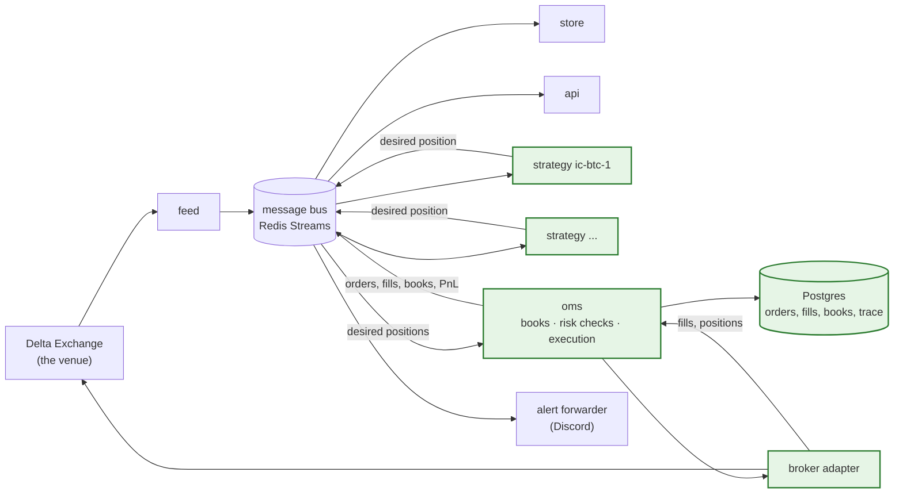

# The execution half: overview

**What this page contains.** A picture of the whole system once it can trade, a description of each
new part, and the rules that every other page in this folder follows. The pages after this one each
take one part and explain it fully.

**How to read it.** Read the first two sections, then follow the reading order at the bottom. Words
in **bold** on first use are defined where they appear, and again in [Glossary](../../final-design/glossary.md)
once they land there. Everything here is a **decision, not a description**: none of it is built yet.
[Architecture](../../final-design/architecture.md) describes what is built.

**One rule shaped every decision here: build the broad machine first.** Every part below is the
simplest version that lets one strategy trade end to end in a sandbox, with every step traceable to
what caused it. The intricate behaviours (partial fills, a restart mid-trade, pooling orders across
strategies) are named in each page's *Open questions* and left for later, on purpose.

## The whole machine, in one picture

The left half exists today: one connection to the venue, a message bus, a store, an API and a web
page. The right half is what this folder designs: the parts that decide what to hold, work out what
to order, check it, and send it.

Green boxes are new. Everything else is running today and is unchanged by this design.

## The new parts, one at a time

| Part | What it does | What it deliberately does not do |
|---|---|---|
| **Strategy** | Decides what position it wants to hold, and publishes that whole position every time its mind changes. One running program per strategy. | Never names an order, a price, an order type, or the sequence legs are sent in. |
| **OMS** (order management system) | Keeps the books, works out the difference between what strategies want and what is held, checks each order against the risk rules, and sends it. | Never decides *whether* to trade. That is the strategy's job. |
| **Risk checks** (RMS, risk management system) | A module inside the OMS. Every order passes through six checks before it is sent. A failed check rejects the order outright. | Never shrinks or reshapes an order. It says yes or no. |
| **Broker adapter** | The one part that speaks a broker's own API. Two exist at first: the real Delta adapter, and a **paper broker** that fills orders against the live prices without touching the venue. | Nothing outside the adapter learns a broker's vocabulary. |
| **Postgres** | The database holding orders, fills, book snapshots, each strategy's counters, and the trace of every event on the order path. | Never a source of market data. That stays on the bus and in Parquet. |

## The vocabulary the design uses

Three words are overloaded elsewhere and are pinned here.

| Word | Meaning in this folder | Where it means something else |
|---|---|---|
| **Book** | A table of *signed lots per contract*: how many of each contract someone wants, or holds. Negative is short. There are six, explained in [books.md](books.md). | Nowhere else in this repository. |
| **Strategy** | One running program that decides on a position. | On Convex Hedge's terminal a strategy is a backtestable rule; in `payoff-project` it is a set of option legs. |
| **Strategy set** | Every strategy program currently running. | The senior's diagram calls this *Portfolio*. That word already means a set of backtest runs on the terminal, so it is not used here. |

## The rules every page follows

1. **A strategy publishes a position, never an order.** Everything about *how* to trade lives in the OMS.
2. **The broker is the truth about what is held.** The engine keeps its own record and checks it against the broker's, contract by contract, every ten seconds. When they disagree, that contract is frozen and a person is told.
3. **Every event says who caused it.** Three identifiers on every message make any fill traceable back to the decision that started it. [events-and-tracing.md](events-and-tracing.md).
4. **A risk check says no, or nothing.** It never changes an order.
5. **The sandbox is the same software.** A second OMS instance with the paper broker behind it, reading the same live prices. Stream names carry the venue, so `PAPER` and `DELTA` never mix.
6. **No real money in this phase.** The paper broker runs the sample strategy first; the venue's testnet is next; live trading is a decision taken later, by a person.

## Reading order

1. [books.md](books.md) — the six books, working orders, and the check that catches a double fire
2. [strategy-worker.md](strategy-worker.md) — what a strategy is, and the sample iron condor as a state machine
3. [oms.md](oms.md) — from desired position to sent order: the order lifecycle, legging, and the tables
4. [rms.md](rms.md) — the six risk checks and what happens when one fails
5. [paper-broker.md](paper-broker.md) — how a fill is made up, and the door for manual trades
6. [events-and-tracing.md](events-and-tracing.md) — the new events, the three identifiers, one traced day
7. [operations.md](operations.md) — commands, the kill switch, and what a restart loses

## What is out of scope, on purpose

- Pooling orders across strategies so that opposite positions cancel out. Orders are per strategy for now; [books.md](books.md) says why.
- Any execution method beyond "limit at the touch, then cancel and replace".
- A dashboard page. The API gains read-only routes; a page is a later ticket.
- A second real broker. The adapter interface is designed so IBKR could be added; only Delta and the paper broker are built.
- Automatic flattening on a loss limit. A breach blocks new opening orders and tells a person.
