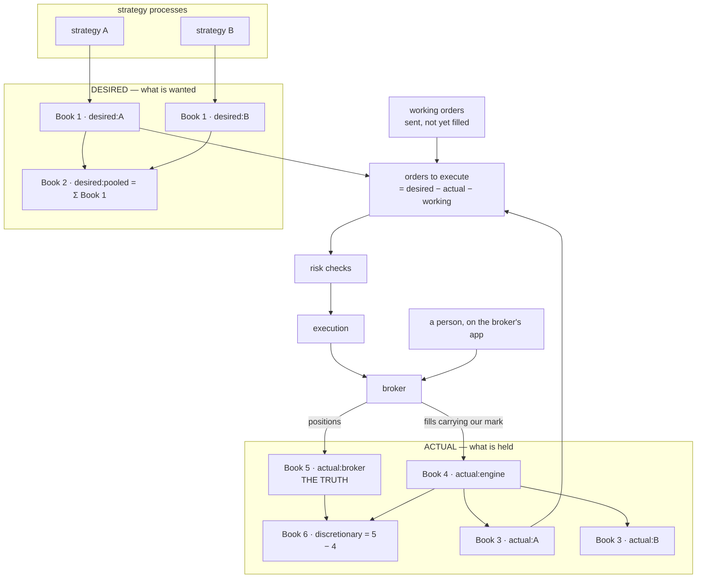

# The books

**What this page contains.** What a book is, the six books the OMS keeps, the seventh thing that is
not a book but must sit beside them, how orders are worked out from them, and the check that keeps the
engine from firing twice or firing when a person already traded by hand.

**How to read it.** Start with the definition and the picture. The table after it is the reference.
The last two sections, on how orders are derived and how the books are checked, are the reason this
page exists.

## What a book is

A **book** is a table with one row per contract and one number in each row: **signed lots**. Positive
means long (we own it), negative means short (we sold it), zero means nothing. A book says nothing
about prices, orders or time. It is a snapshot of a position.

Two kinds of book exist, and the whole design turns on the difference:

- A **desired** book says what someone *wants* to hold.
- An **actual** book says what *is* held.

Orders exist only to make the actual books look like the desired ones.

## The picture

## The six books and the seventh thing

| Book | Name in code | Kind | Who writes it | How it is made |
|---|---|---|---|---|
| **1** | `desired:<strategy>` | desired | the strategy | Published whole by the strategy every time its target changes. One per running strategy. |
| **2** | `desired:pooled` | desired | the OMS | The sum of every Book 1, contract by contract. Two strategies opposite in one contract net to zero here. |
| **3** | `actual:<strategy>` | actual | the OMS | Book 4 split by strategy, using the strategy identifier every engine order carries. |
| **4** | `actual:engine` | actual | the OMS | Built only from fills the broker adapter marked as the engine's. Equals the sum of every Book 3. |
| **5** | `actual:broker` | actual | the broker | The broker's own net position per contract, exactly as reported. Includes everything anyone did, by any means. **Never overridden.** |
| **6** | `actual:discretionary` | actual | the OMS | Book 5 minus Book 4. Whatever is held that the engine cannot claim as its own. Derived, never typed in. |
| — | `working` | neither | the OMS | Every order sent and not yet filled, cancelled or rejected, as signed lots per contract. Not a book, because it is not a position, but the order calculation is wrong without it. |

**Why Book 6 is derived rather than declared.** Delta's API has no field saying where an order came
from. Positions come back as one net number per contract with no history attached. The only mark the
engine can leave is the **client order id**, a short string the engine chooses when it places an order
and the broker echoes back on the order and on every fill. Trades placed on Delta's website carry no
such id. So "engine" means *has our id* and "discretionary" means *does not*, and the adapter decides
which on every fill. A second broker will mark orders its own way; the adapter hides that.

## How orders are worked out

**Per strategy, not pooled.** For each strategy and each contract:

> orders to execute = Book 1 − Book 3 − working

The senior's diagram writes this with the pooled books, Book 2 − Book 4. That would let one order serve
two strategies, and it would make Book 3 an *allocation* the OMS invents rather than a fact the broker
confirms. For this phase every order belongs to exactly one strategy, so every fill carries exactly one
strategy identifier and Book 3 is exact. Pooling can be added later as an OMS option without changing
what any book means. **This deviation is to be confirmed with the senior.**

Books 2 and 4 are still kept. The engine-wide risk checks read them.

**Why working orders are subtracted.** Without them, the gap between desired and actual is recomputed
every second and re-sent every second until the first fill lands. Subtracting what is already on its
way is the first defence against double firing.

## The check that catches a double fire

Every ten seconds, and on every fill, the OMS runs a **reconciliation**:

1. Ask the broker for its positions. That is Book 5.
2. Ask the broker for its fills since the last check. The adapter marks each one *engine* or *manual*.
3. Rebuild Book 4 from the engine-marked fills, and compare it with the Book 4 the OMS built from the
   fills it was told about as they happened. **These are two independent records of the same thing.**
4. Check the two identities, contract by contract: **Book 4 + Book 6 = Book 5**, and **Σ Book 3 = Book 4**.

When any contract disagrees, the OMS **freezes that contract**: no new order for it is sent, an alert
names the contract and both numbers, and a person unfreezes it with a command once they understand why.
The other contracts keep trading. The engine-wide stop is the kill switch, in [operations.md](operations.md).

A worked case. A strategy is short 2 lots of the 60000 put. At 10:00 a person sells 2 more by hand on
the app. Delta now reports −4. At the next check: Book 5 is −4, Book 4 is −2 (only two fills carry our
id), Book 6 becomes −2. Book 1 still says −2, Book 3 says −2, working is 0. Orders to execute: zero.
Nothing fires. The person's trade sits in Book 6, visible, and never touched by the engine.

## The sandbox has the same books

The paper broker is a broker like any other, so a sandbox OMS keeps Books 1 to 6 for venue `PAPER`.
Because the paper broker has a door for manual orders ([paper-broker.md](paper-broker.md)), Book 6 can
be non-zero in the sandbox, and the reconciliation above can be tested on a laptop with no keys.

## Open questions

- Whether pooling across strategies is wanted at all, and if so when. Ask the senior.
- What the reconciliation should do when the broker's fill history and its position disagree with each
  other, which can happen briefly after a settlement. Freeze and alert is the default answer.

## Where to go next

[strategy-worker.md](strategy-worker.md) shows who writes Book 1. [oms.md](oms.md) shows what happens
to "orders to execute" after this page hands it over.
