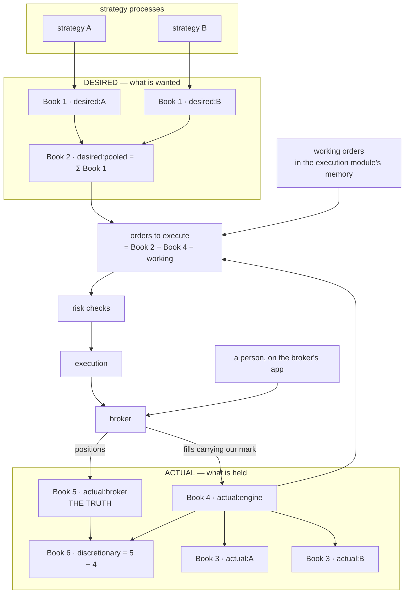
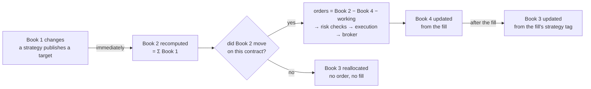

# The books

**What this page contains.** What a book is, the six books the OMS keeps, the seventh thing that is
not a book and does not live beside them, how orders are worked out, what happens when a strategy
changes its mind and there is still nothing to trade, and the check that keeps the engine from firing
twice or firing when a person already traded by hand.

**How to read it.** Start with the definition and the picture; the table after it is the reference.
The three sections after that — how orders are derived, how the books move when no order is needed,
and how Book 3 is filled in — are the reason this page exists.

## What a book is

A **book** is a table with one row per contract and one number in each row: **signed lots**. Positive
means long (we own it), negative means short (we sold it), zero means nothing. A book says nothing
about prices, orders or time. It is a snapshot of a position.

Two kinds of book exist, and the whole design turns on the difference:

- A **desired** book says what someone *wants* to hold.
- An **actual** book says what *is* held.

Orders exist only to make the actual books look like the desired ones.

## The picture

## The six books and the seventh thing

| Book | Name in code | Kind | Who writes it | How it is made |
|---|---|---|---|---|
| **1** | `desired:<strategy>` | desired | the strategy | Published whole by the strategy every time its target changes. One per running strategy. |
| **2** | `desired:pooled` | desired | the OMS | The sum of every Book 1, contract by contract. Two strategies opposite in one contract net to zero here. **This is the book orders are worked out from.** |
| **3** | `actual:<strategy>` | actual | the OMS | Book 4 split by strategy, using the strategy tag the broker echoes on every engine fill. Also written directly, with no fill behind it, in the case below. |
| **4** | `actual:engine` | actual | the OMS | Built only from fills the broker adapter marked as the engine's. Equals the sum of every Book 3. |
| **5** | `actual:broker` | actual | the broker | The broker's own net position per contract, exactly as reported. Includes everything anyone did, by any means. **Never overridden.** |
| **6** | `actual:discretionary` | actual | the OMS | Book 5 minus Book 4. Whatever is held that the engine cannot claim as its own. Derived, never typed in. |
| — | `working` | neither | the execution module | Every order sent and not yet filled, cancelled or rejected, as signed lots per contract. |

**`working` is not a book, and it does not live with them.** The six books are positions and each is
written to Postgres as it changes. Working orders are neither: they are an in-memory structure inside
the **execution module**, the only part that knows an order is in flight, and they die with the
process. That is deliberate. A table of them would be a second record of something the broker already
knows authoritatively, and the two would disagree the first time the OMS was killed between sending an
order and writing the row. On restart the execution module asks the broker for its **open orders** and
rebuilds the structure from them, matching each to our record by its client order id — the same
principle as Book 5, applied to orders instead of positions.

**Why Book 6 is derived rather than declared.** Delta's API has no field saying where an order came
from, and positions come back as one net number per contract with no history attached. The only mark
the engine can leave is the **client order id**, a short string it chooses when placing an order and
the broker echoes back on the order and on every fill. Trades placed on Delta's website carry no such
id, so "engine" means *has our id* and "discretionary" means *does not*, decided by the adapter on
every fill.

## How orders are worked out

**Pooled, from Book 2.** For each contract:

> orders to execute = Book 2 − Book 4 − working

Book 1 never appears in that line. A strategy's own desire reaches the order path only through the sum,
so two strategies that want opposite things in one contract produce no order at all — the engine does
not pay two spreads to end where it already is. Book 1 minus Book 4 would not be a meaningful
subtraction: one is one strategy's wish, the other is every strategy's position.

Book 2 is recomputed the instant a target arrives. Book 3 moves last in either branch.

**Why working orders are subtracted.** Without them, the gap is recomputed every second and re-sent
every second until the first fill lands. Subtracting what is already on its way is the first defence
against double firing.

**Netting needs both targets in hand.** Book 2 moves the moment one strategy publishes. If strategy A
publishes at 08:00:00.0 and strategy B publishes the offsetting target 200 ms later, the engine fires
on A, then fires the opposite on B: two round trips and two spreads paid to end flat. So a Book 2
change waits a short **settling window** — an OMS parameter, a few hundred milliseconds — before it
becomes intents, and every target arriving inside the window is folded in first. That window is the
price of pooling.

## When the pooled book does not move

Strategy A is long 2 lots of the 60000 call and strategy B wants to be long 2 of the same. A publishes
a target giving it up; B publishes a target taking it on. Book 1 changed twice. Book 2 did not change
at all, so `Book 2 − Book 4 − working` is zero and no order is sent — correctly, because the engine
already holds exactly what the strategy set now wants.

But Book 3 must still move: A is no longer long those two lots and B now is. The OMS writes the new
split directly, as a **reallocation**: no order, no fill, Book 4 untouched, `Σ Book 3 = Book 4` still
holding, and a `book.snapshot` for each strategy so that both see their new position. A reallocation
is recorded as its own kind of entry, so that a Book 3 row which changed without a fill can be told
from one that changed because of one.

With one strategy running this can never happen, and with two it will be rare. It is written down
anyway because it is the same code path the OMS needs regardless — Book 3 is recomputed after every
Book 1 or Book 4 change — and because a Book 3 that failed to move here would leave a strategy trading
against a position it does not know it has.

## How Book 3 is filled in, and the problem with it

Book 3 is **derived from Book 4** using the strategy tag the broker gives back: our client order id,
`E.<strategy id>.<sequence>`, echoed on the order and on every fill. The OMS reads the strategy off
the fill and adds the lots to that strategy's Book 3. Attribution is therefore something the broker
confirms rather than something the engine invents, which is why it is done this way.

**Two things are wrong with it, and both are accepted for now.**

1. **Many brokers give no such tag.** Delta echoes a client order id; that is what makes this work
   here. A broker that does not echo one — and several do not — leaves the adapter nothing to read,
   and Book 3 would have to become a pure engine-side allocation with no external confirmation at all.
   The adapter interface hides which kind of broker it is talking to, so that change would be confined
   to one module, but the *meaning* of Book 3 would change with it, from a fact to a bookkeeping entry.
2. **One order can serve two strategies.** Pooling is exactly the case where A wanting +2 and B wanting
   −1 produce one order for +1, and one client order id can only name one strategy. The rule written
   is that the order carries the tag of the strategy whose target change caused it; when two strategies
   move the same contract inside one settling window, that tag names one of them and Book 3's split is
   wrong by the other's amount, while `Σ Book 3 = Book 4` still holds.

Neither bites with one strategy running, which is the whole of this phase. Both are in the open
questions below, and the second is why the reconciliation checks `Σ Book 3 = Book 4` rather than
assuming it.

## The check that catches a double fire

Every ten seconds, and on every fill, the OMS runs a **reconciliation**:

1. Ask the broker for its positions. That is Book 5.
2. Ask the broker for its fills since the last check. The adapter marks each one *engine* or *manual*.
3. Rebuild Book 4 from the engine-marked fills, and compare it with the Book 4 the OMS built from the
   fills it was told about as they happened. **These are two independent records of the same thing.**
4. Check the two identities, contract by contract: **Book 4 + Book 6 = Book 5**, and **Σ Book 3 = Book 4**.

When any contract disagrees, the OMS **freezes that contract**: no new order for it is sent, an alert
names the contract and both numbers, and a person unfreezes it with a command once they understand why.
The other contracts keep trading. The engine-wide stop is the kill switch, in [operations.md](operations.md).

A worked case. A strategy is short 2 lots of the 60000 put. At 10:00 a person sells 2 more by hand on
the app. Delta now reports −4. At the next check: Book 5 is −4, Book 4 is −2 (only two fills carry our
id), Book 6 becomes −2. Book 2 still says −2 and working is 0, so `Book 2 − Book 4 − working` is zero.
Nothing fires. The person's trade sits in Book 6, visible, and never touched by the engine.

## The sandbox has the same books

The paper broker is a broker like any other, so a sandbox OMS keeps Books 1 to 6 for venue `PAPER`.
Because the paper broker has a door for manual orders ([paper-broker.md](paper-broker.md)), Book 6 can
be non-zero in the sandbox, and the reconciliation above can be tested on a laptop with no keys.

## Open questions

- The allocation rule when two strategies want the same contract: the causing strategy's tag, as
  written, or a pro-rata split the OMS computes itself. It decides every per-strategy number on a
  dashboard, and it does not matter until a second strategy runs.
- What Book 3 becomes on a broker that echoes no client order id. Written: an engine-side allocation,
  confined to the adapter's marking step. Nothing depends on it yet.
- The settling window's length. Written: a few hundred milliseconds, one parameter. Measure how fast
  two strategies actually publish before fixing a number.
- What the reconciliation should do when the broker's fill history and its position disagree with each
  other, which can happen briefly after a settlement. Freeze and alert is the default answer.

## Where to go next

[strategy-worker.md](strategy-worker.md) writes Book 1; [oms.md](oms.md) takes "orders to execute".
