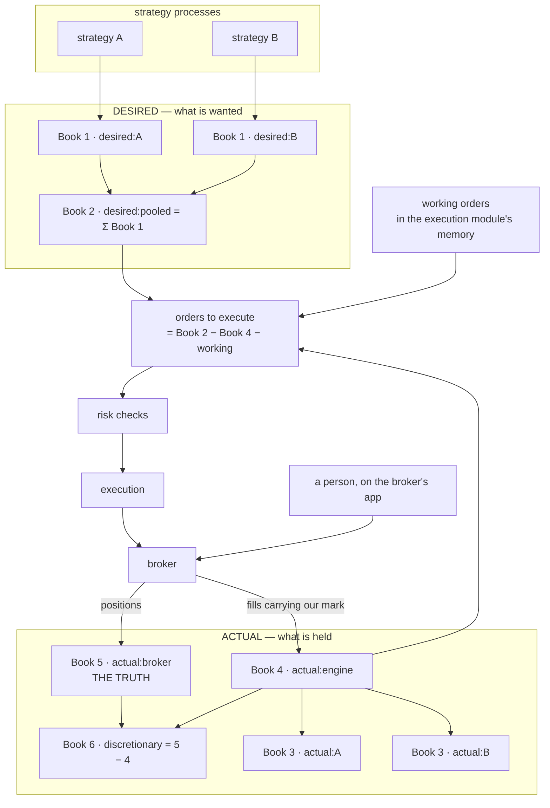
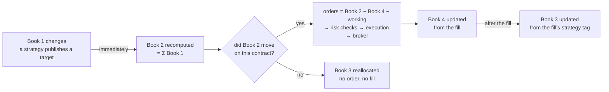

# The books

**What this page contains.** What a book is, the six books the OMS keeps, the seventh thing that is
not a book and does not live beside them, how orders are worked out, what happens when a strategy
changes its mind and there is still nothing to trade, and the check that keeps the engine from firing
twice or firing when a person already traded by hand, and repairs what it finds.

**How to read it.** Start with the definition and the picture; the table after it is the reference.
The three sections after that — how orders are derived, how the books move when no order is needed,
and how Book 3 is filled in — are the reason this page exists.

## What a book is

A **book** is a table with one row per contract and one number in each row: **signed lots**. Positive
means long (we own it), negative means short (we sold it), zero means nothing. A book says nothing
about prices, orders or time. It is a snapshot of a position.

Two kinds of book exist, and the whole design turns on the difference:

- A **desired** book says what someone *wants* to hold.
- An **actual** book says what *is* held.

Orders exist only to make the actual books look like the desired ones.

## The picture

```mermaid
flowchart TB
  subgraph S["strategy processes"]
    S1["strategy A"]; S2["strategy B"]
  end
  subgraph D["DESIRED — what is wanted"]
    B1a["Book 1 · desired:A"]; B1b["Book 1 · desired:B"]; B2["Book 2 · desired:pooled = Σ Book 1"]
    B1a --> B2; B1b --> B2
  end
  subgraph A["ACTUAL — what is held"]
    B5["Book 5 · actual:broker<br/>THE TRUTH"]; B4["Book 4 · actual:engine"]; B6["Book 6 · discretionary = 5 − 4"]
    B3a["Book 3 · actual:A"]; B3b["Book 3 · actual:B"]
    B5 --> B6; B4 --> B6; B4 --> B3a; B4 --> B3b
  end
  W["working orders<br/>in the execution module's memory"]
  O["orders to execute<br/>= Book 2 − Book 4 − working"]
  S1 --> B1a; S2 --> B1b
  B2 & B4 & W --> O
  O --> RMS["risk checks"] --> X["execution"] --> BK["broker"]
  BK -- "positions" --> B5
  BK -- "fills carrying our mark" --> B4
  H["a person, on the broker's app"] --> BK
```

## The six books and the seventh thing

| Book | Name in code | Kind | Who writes it | How it is made |
|---|---|---|---|---|
| **1** | `desired:<strategy>` | desired | the strategy | Published whole by the strategy every time its target changes. One per running strategy. |
| **2** | `desired:pooled` | desired | the OMS | The sum of every Book 1, contract by contract. Two strategies opposite in one contract net to zero here. **This is the book orders are worked out from.** |
| **3** | `actual:<strategy>` | actual | the OMS | Book 4 split by strategy, using the strategy tag the broker echoes on every engine fill. Also written directly, with no fill behind it, in the case below. |
| **4** | `actual:engine` | actual | the OMS | Built only from fills the broker adapter marked as the engine's. Equals the sum of every Book 3. |
| **5** | `actual:broker` | actual | the broker | The broker's own net position per contract, exactly as reported. Includes everything anyone did, by any means. **Never overridden.** |
| **6** | `actual:discretionary` | actual | the OMS | Book 5 minus Book 4. Whatever is held that the engine cannot claim as its own. Derived, never typed in. |
| — | `working` | neither | the execution module | Every order sent and not yet filled, cancelled or rejected, as signed lots per contract. |

**`working` is not a book, and it does not live with them.** The six books are positions, each
published as a `book.snapshot` when it changes and written to Postgres by the persistence service.
Working orders live only in the **execution module**'s memory and die with the process, on purpose:
the broker holds the authoritative list of what is open. On restart the module asks the broker for its
**open orders** and matches each to the `orders` records in the OMS's restore reply
([message-bus.md](message-bus.md)) by client order id — Book 5's principle, applied to orders.

**Why Book 6 is derived rather than declared.** Delta's API has no field saying where an order came
from. The only mark the engine can leave is the **client order id**, a short string it chooses and the
broker echoes on the order and every fill. Trades placed on Delta's website carry none, so "engine"
means *has our id* and "discretionary" means *does not*, decided by the adapter on every fill.

## How orders are worked out

**Pooled, from Book 2.** For each contract:

> orders to execute = Book 2 − Book 4 − working

Book 1 never appears in that line. A strategy's own desire reaches the order path only through the sum,
so two strategies that want opposite things in one contract produce no order at all — the engine does
not pay two spreads to end where it already is. Book 1 minus Book 4 would not be a meaningful
subtraction: one is one strategy's wish, the other is every strategy's position.

```mermaid
flowchart LR
  B1["Book 1 changes<br/>a strategy publishes a target"]
  B2["Book 2 recomputed<br/>= Σ Book 1"]
  Q{"did Book 2 move<br/>on this contract?"}
  ORD["orders = Book 2 − Book 4 − working<br/>→ risk checks → execution → broker"]
  B4["Book 4 updated<br/>from the fill"]
  B3a["Book 3 updated<br/>from the fill's strategy tag"]
  B3b["Book 3 reallocated<br/>no order, no fill"]
  B1 -- "immediately" --> B2 --> Q
  Q -- "yes" --> ORD --> B4 -- "after the fill" --> B3a
  Q -- "no" --> B3b
```

Book 2 is recomputed the instant a target arrives. Book 3 moves last in either branch.

**Why working orders are subtracted.** Without them, the gap is recomputed every second and re-sent
every second until the first fill lands. Subtracting what is already on its way is the first defence
against double firing.

**Netting needs both targets in hand.** Book 2 moves the moment one strategy publishes. If strategy A
publishes at 08:00:00.0 and strategy B publishes the offsetting target 200 ms later, the engine fires
on A, then fires the opposite on B: two round trips and two spreads paid to end flat. So a Book 2
change waits a short **settling window** — an OMS parameter, a few hundred milliseconds — before it
becomes intents, and every target arriving inside the window is folded in first. That window is the
price of pooling.

## When the pooled book does not move

Strategy A is long 2 lots of the 60000 call and strategy B wants to be long 2 of the same. A publishes
a target giving it up; B publishes a target taking it on. Book 1 changed twice. Book 2 did not change
at all, so `Book 2 − Book 4 − working` is zero and no order is sent — correctly, because the engine
already holds exactly what the strategy set now wants.

But Book 3 must still move: A is no longer long those two lots and B now is. The OMS writes the new
split directly, as a **reallocation**: no order, no fill, Book 4 untouched, `Σ Book 3 = Book 4` still
holding, and a `book.snapshot` for each strategy so that both see their new position. A reallocation
is published as its own event, `book.reallocation`, and kept in the `reallocations` table, so that a
Book 3 row which changed without a fill can be told from one that changed because of one.

With one strategy running this never happens. It is the same code path regardless — Book 3 is
recomputed after every Book 1 or Book 4 change — and a Book 3 that failed to move would leave a
strategy trading against a position it does not know it has.

## How Book 3 is filled in, and the problem with it

Book 3 is **derived from Book 4** using the strategy tag the broker gives back: our client order id,
`E.<strategy id>.<sequence>`, echoed on the order and on every fill. The OMS reads the strategy off
the fill and adds the lots to that strategy's Book 3. Attribution is therefore something the broker
confirms rather than something the engine invents, which is why it is done this way.

**Two things are wrong with it, and both are accepted for now.**

1. **Many brokers give no such tag.** Delta echoes a client order id; several brokers do not. There,
   Book 3 would be an engine-side allocation with no external confirmation: confined to the adapter,
   but changing Book 3's meaning from a fact to a bookkeeping entry.
2. **One order can serve two strategies.** Pooling is exactly the case where A wanting +2 and B wanting
   −1 produce one order for +1, and one client order id can only name one strategy. The rule written
   is that the order carries the tag of the strategy whose target change caused it; when two strategies
   move the same contract inside one settling window, that tag names one of them and Book 3's split is
   wrong by the other's amount, while `Σ Book 3 = Book 4` still holds.

Neither bites with one strategy running. The second is why the reconciliation checks
`Σ Book 3 = Book 4` rather than assuming it.

## The check that catches a double fire, and the repair

Every ten seconds, and on every fill, the OMS runs a **reconciliation**:

1. Ask the broker for its positions. That is Book 5.
2. Ask the broker for its fills since the last check. The adapter marks each one *engine* or *manual*.
3. Rebuild Book 4 from the engine-marked fills, and compare it with the Book 4 the OMS built from the
   fills it was told about as they happened. **These are two independent records of the same thing.**
4. Check the two identities, contract by contract: **Book 4 + Book 6 = Book 5**, and **Σ Book 3 = Book 4**.

**The broker wins, and the gap is repaired**, within limits. Two cases lead to new orders:

| Case | What the OMS does | Limit |
|---|---|---|
| **An order was cancelled and the gap is still open** — cancel and replace gave up, a legging timeout cancelled a wave, or the broker cancelled it | Fires again for what remains of `Book 2 − Book 4 − working` | **3 re-fires per contract per `decision_id`** |
| **The two records of Book 4 disagree** | Replaces its own Book 4 with the one rebuilt from the broker's fills, and recomputes the gap. Any order that follows goes through all six risk checks like any other | **2 repairs per contract per day** |

Past either limit (both OMS parameters), the OMS **freezes that contract**: no new order for it, an
alert naming the contract and both numbers, and a person unfreezes it with a command. Other contracts
keep trading. The engine-wide stop is the kill switch ([operations.md](operations.md)). **Book 6 never
causes an order**: the repair works only on what the engine claims as its own.

A worked case. A strategy is short 2 lots of the 60000 put; at 10:00 a person sells 2 more on the app.
At the next check Book 5 is −4, Book 4 is −2 (only two fills carry our id), Book 6 is −2. Book 2 says
−2 and working is 0, so the gap is zero and nothing fires. The manual trade sits in Book 6, untouched.

## The sandbox has the same books

The paper broker is a broker like any other, so a sandbox OMS keeps Books 1 to 6 for venue `PAPER`.
Its manual door ([paper-broker.md](paper-broker.md)) makes Book 6 non-zero, so the reconciliation
above can be tested on a laptop with no keys.

## Open questions

- The allocation rule when two strategies want the same contract: the causing strategy's tag, as
  written, or a pro-rata split. It does not matter until a second strategy runs.
- What Book 3 becomes on a broker that echoes no client order id. Written: an engine-side allocation,
  confined to the adapter's marking step. Nothing depends on it yet.
- The settling window's length. Written: a few hundred milliseconds, one parameter. Measure how fast
  two strategies actually publish before fixing a number.
- What the reconciliation should do when the broker's fill history and its position disagree, briefly,
  after a settlement. There is no single broker record to adopt. Written: freeze and alert.
- How Book 3 links to Book 4 through working orders, fills, open orders, positions, strategy tags and
  combinations of contracts. **For Bilal**; the attribution rule above stands meanwhile.

## Where to go next

[strategy-worker.md](strategy-worker.md) writes Book 1; [oms.md](oms.md) takes "orders to execute".
