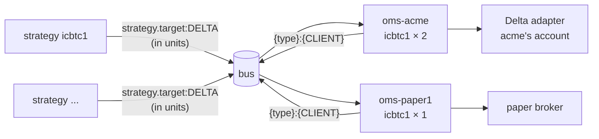

# Clients

**What this page contains.** What a client is, why each client has its own OMS, the client file that
describes one, how a strategy's target becomes a client's position through subscriptions and units,
what happens when a client joins or leaves a strategy, and the points to review before a real client
trades.

**How to read it.** The first two sections are the shape. The client file is the reference. The
**To review** notes near the end are decisions taken for now and flagged to be looked at again.

## What a client is

A **client** is a person or an entity whose capital the engine trades, with its own appetite for risk.
For now **one client is one broker account**, and **each client has its own OMS**: one running
instance of the same OMS image, with its own six books ([books.md](books.md)), its own risk checks
([rms.md](rms.md)), its own kill switch and its own broker adapter.

Nothing crosses clients. One client's freeze, restart or failed order never touches another. Pooling
([books.md](books.md)) happens inside one client only, because two clients' orders go to two separate
accounts.



The strategies are shared. A strategy publishes one target for its market; every client's OMS on that
market reads it, keeps only the strategies the client subscribes to, and sizes them for that client.
Several clients on several brokers therefore follow the same target, each through its own account.

## Strategy units

A strategy decides the **shape** of a position; the client decides its **size**. A strategy publishes
its target in **units**. One unit is the strategy's own leg ratio:

| Strategy | One unit | Lots in one unit |
|---|---|---|
| a straddle | +1 call, +1 put | 2 |
| a 1:3 ratio | +1 at one strike, −3 at another | 4 |
| the sample iron condor | +1, −1, −1, +1 across four strikes | 4 |

A client's **Book 1** for a strategy is that strategy's target multiplied by the client's units for
it, contract by contract. A client holding 2 units of the condor wants +2, −2, −2, +2. Because every
leg is multiplied by the same whole number, the ratio is never broken by rounding.

## The client file

Each client is described by one file, `clients/<id>.yaml`, kept outside the code like the venue files
([data-feed.md](data-feed.md)). Adding a client is adding a file and one OMS service; nothing running
is touched.

```yaml
id: acme
market: DELTA
broker: delta                          # or: paper
credentials: [ACME_DELTA_KEY, ACME_DELTA_SECRET]   # names of variables, never the keys
subscriptions:                         # strategy id → units
  icbtc1: 2
limits:                                # client-wise, plus overrides of strategy defaults
  allocation_cap_usd: 20000
  max_lots_total: 40
  daily_loss_limit_usd: 800
  strategies:
    icbtc1:
      max_units_per_order: 1
```

A change to the file takes effect on the OMS's `reload` command ([operations.md](operations.md)).

## Joining and leaving a strategy

| Change | Takes effect | Why |
|---|---|---|
| A client **subscribes** to a strategy, or raises its units | at the strategy's **next target that starts from flat**; until then the client's Book 1 for it stays empty | a client never enters halfway through a position, at prices the strategy did not decide on |
| A client **unsubscribes**, or lowers its units | **immediately**: its Book 1 for that strategy becomes zero, or the new size | the gap then closes the position through the normal path, with risk checks and legging, like any exit |

Both are logged with the operator's name.

## Paper clients

A **paper client** is a client whose file names the paper broker. Its OMS is the same software, with
its own paper wallet and positions ([paper-broker.md](paper-broker.md)). The sandbox is nothing more
than one or more paper clients. A strategy under test is subscribed by paper clients only.

## Manual trades

A person trades by hand only on the broker's own app, in one client's account. The trade lands in that
client's Book 6 and the engine leaves it alone ([books.md](books.md)).

## To review

> **To review: copy trading.** Manual traders whose positions are copied to several clients are not
> designed. A manual trade stays in the one account it was placed in.

> **To review: client data isolation.** Every client's records share one database, told apart only by
> a `client_id` column ([message-bus.md](message-bus.md)). Before a real client trades, decide whether
> any client's data must be held, handed over or deleted as a unit; that would call for a schema or a
> database per client.

The third point to review, that a strategy's model position and a client's real one can differ, is in
[strategy-worker.md](strategy-worker.md).

## Open questions

- The **fund-manager book**: a named group of clients managed together, for reporting and perhaps a
  combined loss limit. It places no orders. Not designed.
- A client with **several broker accounts**. Written: one account per client. The shape allows one OMS
  per account later.
- A **firm-wide limit across clients**. Written: none; each client's OMS checks only its own account,
  and the total across clients is a read-only sum.

## Where to go next

[oms.md](oms.md) is what each client's OMS does with the target.
