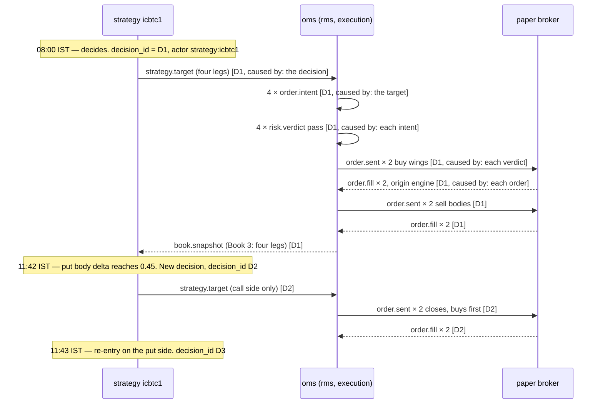

# Events and tracing

**What this page contains.** The new events the execution half publishes, the three identifiers added
to every event so that anything can be traced back to what caused it and who started it, where to look
when tracing, and one whole day of the sample strategy followed through those identifiers.

**How to read it.** The identifiers section is the one to understand; the rest follows from it. The
worked day at the end is what a person would actually do at nine in the evening asking "why did this
fill happen".

## Three identifiers on every event

The existing envelope already gives every event an `event_id`. Three fields are added to it, on every
event of every type, including the market-data events that exist today (where they are simply absent).

| Field | What it holds | Rule for setting it |
|---|---|---|
| `decision_id` | The identifier of the **decision that started this chain** | Set once, when a strategy decides to act. Copied unchanged onto every event that follows from that decision: the target, each intent, each risk verdict, each order, each ack, each fill. |
| `parent_event_id` | The `event_id` of the **one event that directly caused this one** | Set fresh at every hop. A fill's parent is the order; the order's is the intent; the intent's is the target. |
| `actor` | **Who emitted it** | `strategy:<id>`, `oms`, `rms`, `execution`, `broker:delta`, `broker:paper`, or `operator:<name>` for a command a person sent. |

Together they answer the two questions the senior asked for: *what caused this?* (follow
`parent_event_id` backwards, one hop at a time) and *who started this?* (read `actor` on the event
whose `event_id` equals the `decision_id`).

**On the names.** The event-sourcing literature calls these two `correlation_id` and `causation_id`,
and that is what Nautilus and every article on the pattern will say. They are spelled out here instead:
`parent_event_id` says exactly what it holds, which `causation_id` does not, and `decision_id` matches
the sentence below that a chain begins when a strategy decides. The standard names are kept in the
glossary so the pattern is still searchable.

**No fourth field naming the causing actor.** It was asked for and is not added: the parent's actor is
one lookup away, and a duplicated field is a field that can drift out of step with the row it copies.
The lookup is made free instead by putting the emitter in the id — an `event_id` reads
`oms-01J…`, `strategy:icbtc1-01J…` — so `parent_event_id` already shows who emitted the parent without
reading it.

**A market tick never starts a chain.** Ticks arrive about 1,850 times a second; a chain per tick would
be noise. A chain starts when a strategy decides, and the deciding event records which chain snapshot
it looked at, so the tick is still reachable.

This is the correlation-and-causation pattern from event-sourced systems, the same one Nautilus Trader
(the senior's reference) uses under the names `strategy_id`, `client_order_id` and `venue_order_id`.
OpenTelemetry was considered and set aside: Python has no ready instrumentation for Redis Streams, so
it would be hand-built, and it answers a latency question nobody has asked yet.

## The new events

All follow the existing envelope rules: one type per stream, `{type}:{VENUE}[:{UNDERLYING}]`, flat
envelope fields, one JSON payload. Venue is `DELTA` or `PAPER`.

| Event | Emitted by | When | Payload, in short |
|---|---|---|---|
| `strategy.target` | a strategy | its desired position changes | strategy id, the whole Book 1, the chain snapshot it used |
| `strategy.transition` | a strategy | its state machine moves | strategy id, from, to, the counters |
| `order.intent` | oms | a non-zero gap row is found | strategy id, contract, signed lots, the target's ids |
| `risk.verdict` | rms | every intent | pass or reject, the check, the number and the limit |
| `order.sent`, `order.acked`, `order.replaced`, `order.cancelled`, `order.rejected` | execution | each lifecycle step | client order id, venue order id once known, contract, lots, limit price |
| `order.fill` | the adapter | a fill arrives, engine or manual | client order id if any, `origin` engine or manual, strategy id if engine, price, lots, fee |
| `book.snapshot` | oms | any book changes, and every minute | which book, the rows |
| `pnl.snapshot` | oms | every second | scope (strategy or engine), realised, unrealised, day total |
| `recon.result` | oms | every reconciliation | both records of Book 4, the identity check, frozen contracts |
| `alert` | any | as today, plus: frozen contract, legging timeout, loss limit breached | existing shape |
| `control.command` | a person, via the API | as today, with new targets | see [operations.md](operations.md) |

The alert forwarder subscribes to two more streams than today, `order.fill` and `risk.verdict`
(rejections only), and posts them to Discord. A fill on a phone is the cheapest end-to-end check there
is while paper trading.

## Where to look

**The JSON log files, and nothing else.** Every log record already carries `event_id`; it now carries
the three identifiers too, so one filter over the day's file returns a whole chain in order:

```sh
jq -c 'select(.decision_id == "d-2026-09-17-icbtc1-0001")' logs/2026-09-17.jsonl
```

**There is no `event_log` table, and that is a change from the first draft.** A table copying every
order-path event into Postgres was written and then dropped: `orders`, `fills`, `book_snapshots` and
`recon_results` already hold the state that matters, the log files already hold the events, and a chain
is a handful of rows in a file that DuckDB reads directly. A second copy of the same events is a second
thing to keep in step. Add the table the first time a chain genuinely cannot be reconstructed from the
files; that day has not come, and may not.

No log server either. Loki was considered and is the wrong tool for this question: it indexes labels,
and an identifier per chain is exactly the high-cardinality field it warns against. If the log volume
ever justifies a server, VictoriaLogs is the named choice.

## One day, traced

The sample strategy on 17 September, sandbox, one lot.



At nine in the evening: "why is there a fill at 11:42?" Read its `decision_id`, D2. Filter the day's
log on D2. The first line is a `strategy.target` with actor `strategy:icbtc1` and a payload naming
the chain snapshot and the delta that crossed 0.45. The chain of `parent_event_id` from the fill back
to that line is four hops long and every hop is a line in the same result.

## Open questions

- Whether `actor` should also carry the process instance (a restart counter), as Nautilus's
  `instance_id` does, so two runs of the same strategy on one day can be told apart in the log. Cheap,
  and probably yes.
- Whether the trace ever needs a table of its own after all. Written: no. The question comes back the
  first time a chain has to be read across a log rotation.

## Where to go next

[operations.md](operations.md) is what a person can do to the running system, and what a restart costs.
