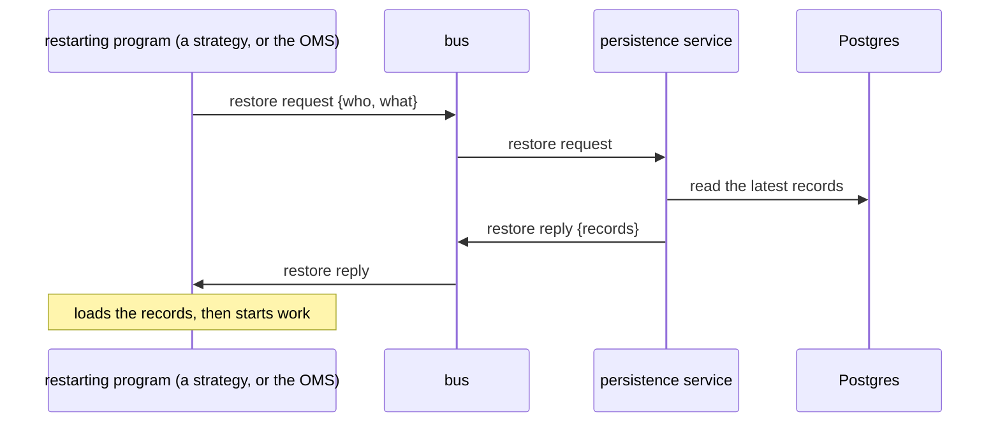

# The message bus and the persistence service

**What this page contains.** How long the bus keeps each message, how that limits the store's flush,
what makes the bus survive its own restart, and the persistence service: the one program that talks to
Postgres, and how every other program gets its records back after a restart.

**How to read it.** Retention and the flush first, because the persistence service leans on the same
numbers. The restore section is what a strategy and the OMS do on every start.

## What the bus is

The **message bus** is Redis Streams. Every program publishes events onto it and reads the events it
needs from it. No program calls another directly. A **stream** holds one type of event for one venue,
named `{type}:{VENUE}[:{UNDERLYING}]`.

Two programs turn bus traffic into lasting records, and they split the data between them:

| Program | Writes | To | What |
|---|---|---|---|
| **store** | market data | Parquet files on S3 | Quotes, chains and trades from the feed |
| **persistence service** | everything else that must last | Postgres | Orders, fills, book snapshots, strategy checkpoints, signal cards, reconciliation results |

## Retention and the store's flush

**Retention** is how long Redis keeps a message before removing it. It is set **per feed**, in that
feed's venue file ([data-feed.md](data-feed.md)), and defaults to **5 minutes**.

The store gathers market data in memory and writes it to S3 every **60 seconds** (its **flush**).
After a restart it reads each stream again from the point of its last flush. So a message must still
be in Redis when the store comes back, or it is lost for good.

**The rule: retention ≥ 3 × flush interval.** The store checks this for every feed when it starts and
refuses a feed whose settings break it, naming the feed in the startup log. At the defaults, 5 minutes
of retention against a 60-second flush leaves about four minutes for a store restart.

## The bus survives its own restart

Redis writes every message to its **append-only file** on disk and forces the file to disk once a
second. A Redis restart therefore loses at most the last second of traffic, not the retention window.
This matters because the persistence service reads records off the bus: a record lost in Redis is a
record never written to Postgres.

## The persistence service

**The only program that holds a Postgres connection.** Strategies, the OMS and the API never connect
to the database. They publish events; the persistence service subscribes to the events that are
records and writes them.

| Event | Table |
|---|---|
| `order.sent`, `order.acked`, `order.replaced`, `order.cancelled`, `order.rejected` | `orders` |
| `order.fill` | `fills` |
| `book.snapshot` | `book_snapshots` |
| `pnl.snapshot` (one a minute) | `pnl_snapshots` |
| `recon.result` | `recon_results` |
| `book.reallocation` | `reallocations` |
| `strategy.checkpoint` | `strategy_checkpoints` |
| `strategy.signal_card` | `signal_cards` |

The tables themselves are described in [oms.md](oms.md) and [strategy-worker.md](strategy-worker.md).

**A record is published before the action it records.** The OMS publishes `order.sent` and only then
hands the order to the broker adapter. If the OMS stops between the two, the record is already on the
bus and the persistence service still writes it; the broker simply never saw the order, and the next
reconciliation says so.

**Writes are idempotent.** Every event carries its `event_id`, and each table keeps it as a unique
key. A record read twice, for example after the persistence service itself restarts, is written once.

**Lag is watched.** The persistence service tracks how far behind the newest message on each stream it
is. When the lag passes **half the retention** of that stream (2.5 minutes at the default), it raises
an alert: past full retention, records are lost.

## Getting records back after a restart

A program with no database connection cannot read its own records. It asks for them over the bus.

| Who asks | What comes back |
|---|---|
| a strategy | its latest row in `strategy_checkpoints` ([strategy-worker.md](strategy-worker.md)) |
| the OMS | the latest `book_snapshots` for every book, and today's `orders` with their client order ids ([oms.md](oms.md)) |
| the sandbox OMS, for the paper broker | every paper fill, so the paper broker's positions are rebuilt ([paper-broker.md](paper-broker.md)) |

**No reply, no work.** A program that has asked and not heard back within **10 seconds** does not start
work. It raises an alert and asks again every 10 seconds. A strategy that does not know its counters
could enter a fourth time; an OMS that does not know its books could fire the whole gap again. Waiting
is the safe choice.

## Open questions

- Whether "Postgres only through the bus" should cover the OMS. Written: yes, everything goes through
  the persistence service. **To confirm with Bilal.**
- Whether the persistence service should run as two instances, so that one can be restarted while the
  other writes. Written: one instance; its lag alert covers a restart.
- The retention and flush numbers per feed once NSE and Cboe feeds exist. Written: the defaults above,
  with the rule checked at startup.

## Where to go next

[data-feed.md](data-feed.md) is where the venue files, and so the retention per feed, live.
