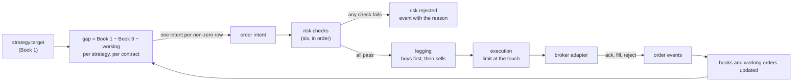
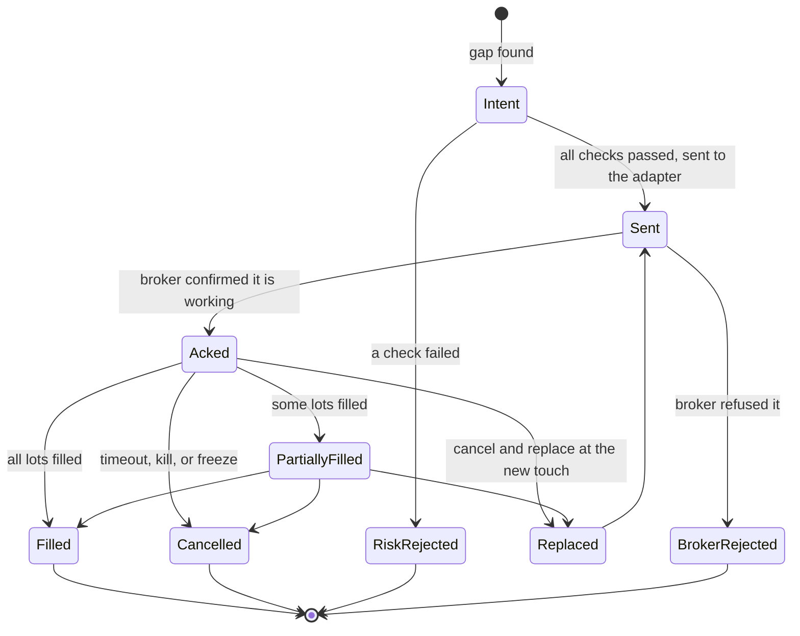

# The order management system

**What this page contains.** What the OMS is, why it is one process with modules inside it rather than
three processes, the path an order takes from a strategy's target to a fill, how the four legs of a
spread are sent, and the tables it keeps.

**How to read it.** The first section is the shape. The order lifecycle and the legging rule are the
two things a newcomer most needs before reading code. The tables at the end are reference.

## What the OMS is

The **OMS** (order management system) is the one process that turns *what is wanted* into *what is
sent*. It keeps the books, computes the gap, checks each order, sends it through a broker adapter, and
records everything it did. It never decides whether to trade.

**One process, three modules.** Risk checks and execution are modules inside the OMS, not separate
processes. The senior's reason for separate processes is that a new strategy must not disturb a
running one. The OMS, its risk checks and its execution change together and share the state of every
order; a bus hop between them would add latency and two more places for a silent stall, and buy no
change-safety. The risk module has one entry point, so it can be lifted into its own process later
without changing what it checks.

**Two instances, one image.** The live OMS is configured with the Delta adapter and reads targets for
venue `DELTA`. The sandbox OMS is the same image with the paper adapter and reads venue `PAPER`. Stream
names already carry the venue, so the two never see each other's traffic.

## From a target to a sent order

Every box on this path publishes an event, and every event carries the identifiers that link it to the
strategy decision that started it. [events-and-tracing.md](events-and-tracing.md) has the list.

## The order lifecycle

An **order** here is one instruction to the broker about one contract: buy or sell, how many lots, at
what limit price. It moves through these states and no others.

| Term | Meaning |
|---|---|
| **Intent** | The OMS has decided an order is needed. It has a strategy identifier, a contract, a signed quantity, and the identifiers of the target that caused it. |
| **Working** | Sent, acked, or partially filled: on its way, and subtracted from the gap. |
| **Client order id** | The string the OMS chooses for each order and the broker echoes back. Delta caps it at 32 characters and requires it to be unique among the account's open orders. Format: `E.<strategy id>.<sequence>`, so a fill's origin and strategy can be read straight off it. |
| **Cancel and replace** | The one execution method in this phase: place a limit at the current best price on our side (the **touch**), wait N seconds, and if unfilled cancel it and place a new one at the new touch. Give up after M attempts and raise an alert. N and M are OMS parameters. |

Market orders are not used. On a thin 0dte wing a market order is how a stop-loss becomes a large loss.

## Legging: buys first

A spread is several orders. They are sent in two waves:

1. **All buy legs first.** Wait until every one is filled.
2. **Then all sell legs.**

The reason is margin: a short option is much cheaper to hold once the long option that caps its loss is
already held. If the buy wave has not filled within a timeout, every working order is cancelled and an
alert names exactly which legs were filled, because a condor whose wings filled and whose bodies did not
is a different position altogether, a long strangle, and a person should know that is what they hold.

The order in which legs are sent, the waiting, and the timeout all live here and never in a strategy.

## Reconciliation

Every ten seconds, and on every fill, the OMS asks the adapter for positions and recent fills and runs
the check in [books.md](books.md). A disagreeing contract is frozen: its intents are refused with the
reason `frozen`, everything else continues, and an alert is raised. A person unfreezes it.

## What the OMS stores

Postgres, one schema, the tables below. Local development and production differ by one connection
string; the deployment page already names a managed PostgreSQL as the OMS's home.

| Table | One row per | Why it exists |
|---|---|---|
| `orders` | order | The lifecycle above, with every timestamp and the client and venue order ids |
| `fills` | fill | Price, quantity, fee, the order it belongs to, and whether the adapter marked it engine or manual |
| `book_snapshots` | book, per minute and on every change | So any book can be read back for any moment |
| `working_orders` | working order | The current set, rebuilt from `orders` on restart |
| `strategy_state` | strategy | The counters and entry credit each strategy persists ([strategy-worker.md](strategy-worker.md)) |
| `pnl_snapshots` | strategy or engine, per minute | Realised and unrealised profit and loss ([rms.md](rms.md)) |
| `recon_results` | reconciliation run | Both records of Book 4, the identity check, and any frozen contract |
| `event_log` | event on the order path | The trace. One query by `correlation_id` returns a whole chain ([events-and-tracing.md](events-and-tracing.md)) |

Redis stays a pipe. Nothing the OMS needs after a restart lives only in Redis.

## What the API exposes

Read-only routes, JSON, so a person can look without opening SQL: the books, working orders, today's
orders and fills, the profit and loss snapshots, and the frozen contracts. A page on top of them is a
later ticket.

## Open questions

- Partial fills across the two legging waves: whether a partially filled buy wave should proceed to a
  proportionally smaller sell wave, or cancel. Written: cancel and alert.
- Whether cancel-and-replace should walk from mid toward the touch rather than start at the touch.
  Better execution, later.
- How the OMS should treat a target that changes while a wave is in flight. Written: finish or cancel
  the wave first, then recompute the gap.

## Where to go next

[rms.md](rms.md) is the module every intent passes through before it is sent.
