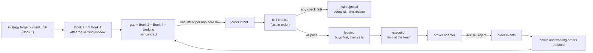
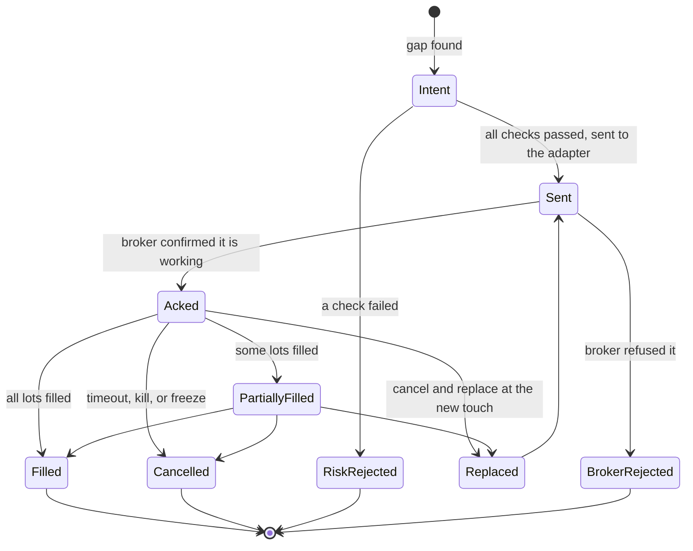

# The order management system

**What this page contains.** What the OMS is, why it is one process with modules inside it rather than
three processes, the path an order takes from a strategy's target to a fill, how the four legs of a
spread are sent, which brokers it can send to, the tables its records land in, and what it does on a
restart.

**How to read it.** The first section is the shape. The order lifecycle and the legging rule are the
two things a newcomer most needs before reading code. The tables at the end are reference.

## What the OMS is

The **OMS** (order management system) is the one process that turns *what is wanted* into *what is
sent*. It keeps the books, computes the gap, checks each order, sends it through a broker adapter, and
records everything it did. It never decides whether to trade.

**One process, three modules.** Risk checks and execution are modules inside the OMS, not separate
processes. Strategies are separate processes so that a new strategy cannot disturb a running one. The OMS, its risk checks and its execution change together and share the state of every
order; a bus hop between them would add latency and two more places for a silent stall, and buy no
change-safety. The risk module has one entry point, so it can be lifted into its own process later
without changing what it checks.

**One instance per client, one image.** Each client's OMS is configured by that client's file
([clients.md](clients.md)): its market, its broker adapter, its subscriptions and its limits. It reads
`strategy.target:{MARKET}` for its market, keeps only the strategies the client subscribes to, and
multiplies each target by the client's units to make the client's Book 1. Everything it publishes goes
to streams named by the client, `{type}:{CLIENT}`, so no client sees another's traffic. A paper
client's OMS is the same image with the paper broker behind it.

**No database connection.** The OMS publishes its records as events, and the persistence service
writes them to Postgres ([message-bus.md](message-bus.md)). It never reads Postgres directly either:
after a restart it asks for its records over the bus.

## From a target to a sent order

```mermaid
flowchart LR
  T["strategy.target × client units<br/>(Book 1)"] --> P["Book 2 = Σ Book 1<br/>after the settling window"]
  P --> G["gap = Book 2 − Book 4 − working<br/>per contract"]
  G -->|"one intent per non-zero row"| I["order intent"]
  I --> R["risk checks<br/>(six, in order)"]
  R -->|"any check fails"| RJ["risk rejected<br/>event with the reason"]
  R -->|"all pass"| L["legging<br/>buys first, then sells"]
  L --> X["execution<br/>limit at the touch"]
  X --> BA["broker adapter"]
  BA -->|"ack, fill, reject"| E["order events"]
  E --> B["books and working orders updated"]
  B --> G
```

Every box on this path publishes an event, and every event carries the identifiers that link it to the
strategy decision that started it. [events-and-tracing.md](events-and-tracing.md) has the list.

## The order lifecycle

An **order** here is one instruction to the broker about one contract: buy or sell, how many lots, at
what limit price. It moves through these states and no others.

```mermaid
stateDiagram-v2
  [*] --> Intent : gap found
  Intent --> RiskRejected : a check failed
  Intent --> Sent : all checks passed, sent to the adapter
  Sent --> Acked : broker confirmed it is working
  Sent --> BrokerRejected : broker refused it
  Acked --> PartiallyFilled : some lots filled
  Acked --> Filled : all lots filled
  PartiallyFilled --> Filled
  Acked --> Replaced : cancel and replace at the new touch
  PartiallyFilled --> Replaced
  Replaced --> Sent
  Acked --> Cancelled : timeout, kill, or freeze
  PartiallyFilled --> Cancelled
  Filled --> [*]
  Cancelled --> [*]
  RiskRejected --> [*]
  BrokerRejected --> [*]
```

| Term | Meaning |
|---|---|
| **Intent** | The OMS has decided an order is needed. It has a contract, a signed quantity, the strategy whose target change caused it, and the identifiers of that target. |
| **Working** | Sent, acked, or partially filled: on its way, and subtracted from the gap. Held in the execution module's memory, never in a table, and rebuilt on restart from the broker's open orders ([books.md](books.md)). |
| **Client order id** | The string the OMS chooses for each order and the broker echoes back. Delta caps it at 32 characters and requires it to be unique among the account's open orders. Format: `E.<strategy id>.<sequence>`, so a fill's origin and strategy can be read straight off it. No client is needed in it: each OMS talks to one client's account only. Orders are pooled, so the strategy named is the one whose change caused the order; [books.md](books.md) says when that is not the whole truth. |
| **Cancel and replace** | The one execution method in this phase: place a limit at the current best price on our side (the **touch**), wait N seconds, and if unfilled cancel it and place a new one at the new touch. Give up after M attempts and raise an alert. N and M are OMS parameters. |

**The record goes first.** The execution module publishes `order.sent` and only then hands the order to
the broker adapter, so no order can reach a broker without a record of it on the bus.

Market orders are not used. On a thin 0dte wing a market order is how a stop-loss becomes a large loss.

## Legging: buys first

A spread is several orders. They are sent in two waves:

1. **All buy legs first.** Wait until every one is filled.
2. **Then all sell legs.**

The reason is margin: a short option is much cheaper to hold once the long option that caps its loss is
already held. If the buy wave has not filled within a timeout, every working order is cancelled and an
alert names exactly which legs were filled, because a condor whose wings filled and whose bodies did not
is a different position altogether, a long strangle, and a person should know that is what they hold.

The order in which legs are sent, the waiting, and the timeout all live here and never in a strategy.

## Reconciliation

Every ten seconds, and on every fill, the OMS asks the adapter for positions and recent fills and runs
the check in [books.md](books.md). The broker's record wins. The OMS repairs what it can: it fires again
for a gap left open by a cancelled order, up to 3 times per contract per decision, and it adopts the
broker's Book 4 when its own disagrees, up to 2 times per contract per day. Past either limit the
contract is frozen: its intents are refused with the reason `frozen`, everything else continues, and an
alert is raised. A person unfreezes it.

## Which brokers it sends to

The OMS talks to a broker only through a **broker adapter**, which has one interface: place, cancel,
list open orders, list fills since a time, list positions, read the wallet. Each client's file names
the one adapter its OMS uses.

| Adapter | Status in this phase |
|---|---|
| **Paper broker** | Built first, and the focus of this phase ([paper-broker.md](paper-broker.md)) |
| **Delta** | Built next, and run against Delta's India testnet |
| a broker for NIFTY and Sensex | Not chosen |
| a broker for SPX and SPXW | Not chosen |

A new broker is a new adapter. Nothing else in the OMS changes.

## What the OMS's records hold

Postgres, one schema, the tables below, all written by the persistence service from events on the bus.
Every table carries a `client_id`, except `strategy_checkpoints` and `signal_cards`, which belong to
strategies and are shared by every client ([clients.md](clients.md) flags this for review).
Local development and production differ by one connection string, held by the persistence service
alone; the deployment page names a managed PostgreSQL for production.

| Table | One row per | Why it exists |
|---|---|---|
| `orders` | order | The lifecycle above, with every timestamp and the client and venue order ids |
| `fills` | fill | Price, quantity, fee, the order it belongs to, and whether the adapter marked it engine or manual |
| `book_snapshots` | book, per minute and on every change | So any book can be read back for any moment |
| `strategy_checkpoints` | strategy checkpoint | Each strategy's state as JSONB, never overwritten ([strategy-worker.md](strategy-worker.md)) |
| `signal_cards` | leg of a decision | What a strategy saw when it decided, for slippage research; never read by the order path ([strategy-worker.md](strategy-worker.md)) |
| `pnl_snapshots` | strategy or client, per minute | Realised and unrealised profit and loss ([rms.md](rms.md)) |
| `recon_results` | reconciliation run | Both records of Book 4, the identity check, and any frozen contract |
| `reallocations` | Book 3 transfer with no fill behind it | The pooled-neutral case in [books.md](books.md): which strategy gave up which lots, and why |

Redis stays a pipe. Nothing the OMS needs after a restart lives only in Redis.

**Two things deliberately have no table.** Working orders, because the broker's open orders are the
better record of them; they live in the execution module's memory. And the event trace: every event is already a line in the JSON log files with
the identifiers on it, and a chain is a handful of rows, so it is filtered there with `jq` or DuckDB
rather than copied into a table nobody has needed yet ([events-and-tracing.md](events-and-tracing.md)).

## What happens on a restart

1. The OMS publishes a restore request naming its client. The persistence service replies with that
   client's latest snapshot of every book and its `orders` rows for today ([message-bus.md](message-bus.md)). Until the reply arrives,
   the OMS sends nothing and raises an alert every 10 seconds.
2. The execution module asks the broker for its open orders and rebuilds the working orders from them,
   matched to the `orders` rows by client order id. An open order with no matching row freezes its
   contract and raises an alert.
3. A reconciliation runs before the first intent is computed.

## What the API exposes

Read-only routes, JSON, each taking the client as a filter, so a person can look without opening SQL: the books, working orders (read from
the execution module, the only place they exist), today's orders and fills, the profit and loss
snapshots, and the frozen contracts. A page on top of them is a
later ticket.

## Open questions

- Partial fills across the two legging waves: whether a partially filled buy wave should proceed to a
  proportionally smaller sell wave, or cancel. Written: cancel and alert.
- Whether cancel-and-replace should walk from mid toward the touch rather than start at the touch.
  Better execution, later.
- How the OMS should treat a target that changes while a wave is in flight. Written: finish or cancel
  the wave first, then recompute the gap.
- Whether the trace ever needs its own Postgres table. Written: no, the log files answer it. Revisit
  the first time a chain cannot be reconstructed from them.

## Where to go next

[rms.md](rms.md) is the module every intent passes through before it is sent.
