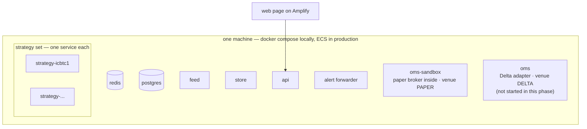

# Operations

**What this page contains.** What runs where once the execution half exists, the commands a person can
send, what each process loses and recovers on a restart, and the order in which the pieces are to be
built.

**How to read it.** The topology and the commands are reference. The restart table is the section to
read before the first time something is restarted in anger.

## What runs where

Everything below joins the existing compose file and, in production, the same single instance. The
earlier decision to move to a second instance "when the OMS places its first order" stands as a go-live
decision; nothing in this design changes if it happens, because every hop is already a bus hop.

| Service | New or existing | Notes |
|---|---|---|
| `postgres` | new | One database. Local: a container with a volume. Production: the managed PostgreSQL the deployment page already names |
| `strategy-<id>` | new, one per strategy | Same image; environment chooses the strategy and its venue |
| `oms-sandbox` | new | The OMS image with the paper adapter. This is the one that runs in this phase |
| `oms` | new, dormant | The OMS image with the Delta adapter. Present in the file, not started, until a test key exists and a person decides |
| everything else | existing | Unchanged. The alert forwarder subscribes to two more streams |

## Commands a person can send

All travel as today's `control.command`, over an HTTP request to the API, and the `target` field
names who must act. Every command carries `actor: operator:<name>`, so it is traceable like anything else.

| Target | Command | Effect |
|---|---|---|
| `oms` | `freeze <contract>` | No new order for that contract. Working orders on it are cancelled |
| `oms` | `unfreeze <contract>` | Lifts a freeze, whether a person or the reconciliation set it |
| `oms` | `kill` | The kill switch: cancel every working order, refuse every new intent, alert. Books keep updating; nothing is flattened |
| `oms` | `resume` | Lifts `kill` |
| `oms` | `reload` | Re-read the risk configuration file |
| `paper` | `manual-order` | Places a manual order at the paper broker ([paper-broker.md](paper-broker.md)) |
| `strategy` | `pause`, `resume` | The strategy stops or restarts evaluating. Its target is left as it is |

`kill` is the engine-wide stop. A frozen contract is the local one. Neither closes a position; closing
is a strategy's decision or a person's on the broker's app, and the books will show it either way.

## What a restart loses and recovers

| Process restarts | Loses | Recovers from | Left over |
|---|---|---|---|
| a strategy | its in-memory state | its `strategy_state` row, then Book 3 | If Book 3 holds legs the row does not know: alert, do nothing |
| `oms-sandbox` | working orders in memory, the paper broker's positions | `orders` and `working_orders` tables, then a reconciliation | The paper broker's Book 5 is rebuilt from the `fills` table, so a sandbox restart is lossless |
| `oms` (live) | working orders in memory | the tables, then the broker's own orders, fills and positions | Any order the broker filled while the OMS was down arrives as a fill on the next reconciliation and is attributed by its client order id |
| `postgres` | nothing, it has a volume | itself | The OMS refuses to start without it, loudly |
| `redis` | the last thirty minutes of bus traffic, as today | the store replays as today | A strategy re-publishes its target on its next evaluation, so a lost target costs at most one second |

The senior's own system loses state on a restart and he named that as its gap. Here every process
that has state writes it to Postgres as it changes, and Redis holds nothing that is not rebuilt.

## The order to build it in

Each step is demonstrable on its own and is the seed of one ticket group.

1. **The envelope gains the three identifiers**, and `event_log` exists. Every existing event still parses.
2. **The paper broker** fills a hand-placed order and keeps a position. No OMS yet.
3. **A strategy publishes a target** and persists its row. The sample condor's state machine, with a fake clock in tests.
4. **The OMS computes the gap and sends orders** to the paper broker with no risk checks, legging buys first. Books 1, 3, 4, 5 exist. Fills reach Discord.
5. **Reconciliation and Book 6**, with the manual door. The worked case in [books.md](books.md) runs as a test.
6. **The six risk checks**, with the configuration file and the loss-limit behaviour.
7. **The read-only API routes**, and the trace query documented and tried on a real day.
8. **One week of the sample strategy in the sandbox**, with the fill record read every evening. Then the Delta adapter against the testnet.

## Open questions

- Whether the live `oms` should exist in the compose file at all before a key exists, or be added by
  the ticket that adds the Delta adapter. Written: present and dormant, so the file shows the shape.
- Who holds the operator names used in `actor`, and whether a command needs any authentication beyond
  the private network the API already sits on.

## Where to go next

Back to [00-overview.md](00-overview.md), or to the spec once these pages are agreed.
