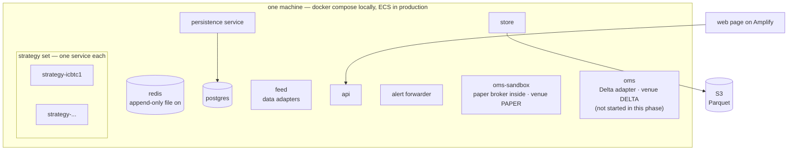

# Operations

**What this page contains.** What runs where once the execution half exists, the commands a person can
send, what each process loses and recovers on a restart, and the order in which the pieces are to be
built.

**How to read it.** The topology and the commands are reference. The restart table is the section to
read before the first time something is restarted in anger.

## What runs where

Everything below joins the existing compose file and, in production, the same single instance. Moving
to a second instance when the OMS places its first real order is a go-live decision; nothing in this
design changes if it happens, because every hop is a bus hop.

```mermaid
flowchart TB
  subgraph M["one machine — docker compose locally, ECS in production"]
    R[("redis<br/>append-only file on")]
    PG[("postgres")]
    PS["persistence service"]
    F["feed<br/>data adapters"]; ST["store"]; API["api"]; DC["alert forwarder"]
    subgraph SS["strategy set — one service each"]
      S1["strategy-icbtc1"]; S2["strategy-..."]
    end
    OS["oms-sandbox<br/>paper broker inside · venue PAPER"]
    OL["oms<br/>Delta adapter · venue DELTA<br/>(not started in this phase)"]
  end
  W["web page on Amplify"] --> API
  PS --> PG
  ST --> S3[("S3<br/>Parquet")]
```

| Service | New or existing | Notes |
|---|---|---|
| `postgres` | new | One database. Local: a container with a volume. Production: the managed PostgreSQL the deployment page names |
| `persistence-service` | new | The only service with a Postgres connection ([message-bus.md](message-bus.md)) |
| `redis` | existing, changed | Append-only file on, forced to disk every second; retention per feed, 5 minutes by default |
| `store` | existing, changed | Flushes to S3 every 60 seconds; refuses a feed whose retention is under 3 × the flush |
| `feed` | existing, changed | Data adapters follow market hours, read instrument lists daily, and take their settings from `venues/` ([data-feed.md](data-feed.md)) |
| `strategy-<id>` | new, one per strategy | Same image; environment chooses the strategy and its venue |
| `oms-sandbox` | new | The OMS image with the paper adapter. This is the one that runs in this phase |
| `oms` | new, dormant | The OMS image with the Delta adapter. Present in the file, not started, until a test key exists and a person decides |
| everything else | existing | Unchanged. The alert forwarder subscribes to two more streams |

## Commands a person can send

All travel as today's `control.command`, over an HTTP request to the API, and the `target` field
names who must act. Every command carries `actor: operator:<name>`, so it is traceable like anything else.

| Target | Command | Effect |
|---|---|---|
| `oms` | `freeze <contract>` | No new order for that contract. Working orders on it are cancelled |
| `oms` | `unfreeze <contract>` | Lifts a freeze, whether a person or the reconciliation set it |
| `oms` | `kill` | The kill switch: cancel every working order, refuse every new intent, alert. Books keep updating; nothing is flattened |
| `oms` | `resume` | Lifts `kill` |
| `oms` | `reload` | Re-read the risk configuration file |
| `strategy` | `pause`, `resume` | The strategy stops or restarts evaluating. Its target is left as it is |

`kill` is the engine-wide stop. A frozen contract is the local one. Neither closes a position; closing
is a strategy's decision or a person's on the broker's app, and the books will show it either way.

**There is no command for placing an order by hand, and there will not be one.** A person who wants to
trade outside the engine does it on Delta's own app, where the venue already handles the order; the
engine's only job is to see it arrive in Book 5, put it in Book 6, and leave it alone. Order entry on
our side would be an authentication surface, a permissions model and a new way to lose money by typo,
for nothing the broker's app does not already do. The paper broker's manual door is a **test hook**, a
direct call from a test, not an operator command ([paper-broker.md](paper-broker.md)).

## What a restart loses and recovers

| Process restarts | Loses | Recovers from | Left over |
|---|---|---|---|
| a strategy | its in-memory state | a restore reply with its latest checkpoint, then Book 3 | If Book 3 holds legs the checkpoint does not know: alert, do nothing. No reply: no evaluation, alert every 10 seconds |
| `oms-sandbox` | working orders in memory, the paper broker's positions | a restore reply (books, today's orders, every paper fill), the broker's open orders, then a reconciliation | The paper broker's Book 5 is rebuilt from the paper fills, so a sandbox restart is lossless |
| `oms` (live) | working orders in memory | a restore reply, then **the broker's own open orders** matched to `orders` by client order id, then a reconciliation | Any order the broker filled while the OMS was down arrives as a fill on the next reconciliation and is attributed by its client order id |
| `persistence-service` | nothing | reads each stream again from its last written event; writes are idempotent | Restore requests go unanswered while it is down, so restarting programs wait. Down longer than the retention: records are lost, which the lag alert warns of first |
| `postgres` | nothing, it has a volume | itself | The persistence service cannot write and raises an alert; its lag grows until Postgres returns |
| `redis` | at most the last second of bus traffic | its append-only file | A strategy re-publishes its target on its next evaluation, so a lost target costs at most one second |

Every process that has state sends it to Postgres as it changes, and Redis holds nothing that is not
either on disk or rebuilt.

**Working orders are the one thing in memory on purpose.** They are not written anywhere, because the
broker already holds the authoritative list of what is open. The restart asks the broker instead.
[books.md](books.md) says the rest.

## The order to build it in

Each step is demonstrable on its own and is the seed of one ticket group. **Every step is built
test-first**: the test that shows the step working is written before the code that makes it pass.

1. **The envelope gains the three identifiers**, and the log lines carry them. Every existing event still parses.
2. **The bus survives a restart**: Redis's append-only file on, the store's 60-second flush, and the retention rule checked at startup ([message-bus.md](message-bus.md)).
3. **The persistence service**: events to Postgres, idempotent writes, restore requests and replies, and the lag alert.
4. **The paper broker** fills a hand-placed order and keeps a position. No OMS yet.
5. **A strategy publishes a target**, its checkpoints and its signal cards, and restores itself on start. The sample condor's state machine, with a fake clock in tests.
6. **The OMS computes the gap and sends orders** to the paper broker with no risk checks, legging buys first. Books 1, 3, 4, 5 exist. Fills reach Discord.
7. **Reconciliation, Book 6 and the repair**, with the manual door. The worked case in [books.md](books.md) runs as a test, and so do both repair limits.
8. **The six risk checks**, with the configuration file and the loss-limit behaviour.
9. **The read-only API routes**, and the trace query documented and tried on a real day.
10. **The data feed's market knowledge**: market calendars, instrument lists, subscription lists, the `venues/` folder, and data adapters kept apart from broker adapters ([data-feed.md](data-feed.md)). It comes late because the sandbox trades Delta, which never closes; it is needed before the first NSE or Cboe feed.
11. **One week of the sample strategy in the sandbox**, with the fill record read every evening. Then the Delta adapter against the testnet.

## Open questions

- Whether the live `oms` should exist in the compose file at all before a key exists, or be added by
  the ticket that adds the Delta adapter. Written: present and dormant, so the file shows the shape.
- Whether a restart that finds an open order at the broker with **no** matching row in `orders` should
  cancel it or freeze its contract. Written: freeze and alert, as a mismatched position is.
- **The authentication layer.** What it protects (the API's read-only routes, its commands, the bus
  itself) and how people and services prove who they are. Nothing is decided; until it is, the API
  relies on the private network it sits on.
- **Which broker serves NIFTY and Sensex, and which serves SPX and SPXW.** Nothing is chosen; the paper
  broker is the focus of this phase, and Delta follows it ([oms.md](oms.md)).
- Who holds the operator names used in `actor`. Today the name is whatever the request says; the
  authentication layer above would set it instead.

## Where to go next

Back to [00-overview.md](00-overview.md), or to the spec once these pages are agreed.
