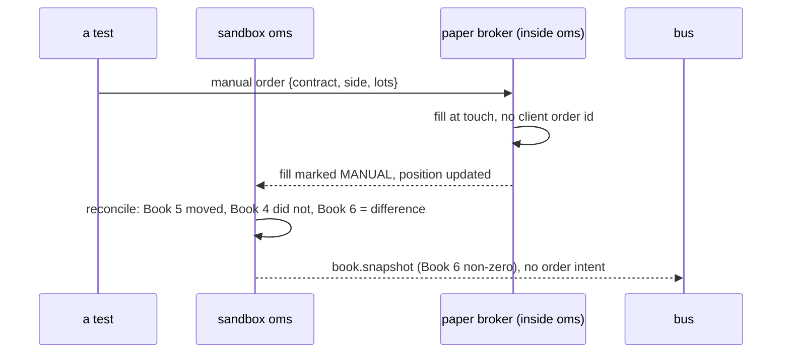

# The paper broker

**What this page contains.** What the paper broker is, why it is the first broker the system trades
against, exactly how it decides a fill, how it keeps its own positions, and the door through which a
person can place a manual trade so that the discretionary book can be tested on a laptop.

**How to read it.** The first section is the idea. The fill rule is the part to argue with. The manual
door is what makes the reconciliation in [books.md](books.md) testable without any keys.

## What it is

The **broker adapter** is the one part of the OMS that speaks a broker's own API: place, cancel, list
orders, list fills, list positions, read the wallet. The **paper broker** is an adapter that speaks no
external API at all. It reads the live prices already on the bus and answers as a broker would, in
memory, inside the sandbox OMS process. Its venue name is `PAPER`.

**Why first.** It needs no account and no keys. Its fills are deterministic, so a test can say what
should have happened. It runs on a laptop with the rest of the stack. And it is the research basis for
paper trading later: a strategy that has run for a week against the paper broker has produced a fill
record, a profit-and-loss history and a trace, all in the same shape the live system will produce.

**What it does not test.** Whether our Delta adapter speaks Delta's order API correctly. That is what
Delta's India testnet is for, once a test key exists. The testnet uses its own base address and its own
keys; production keys do not work against it and the reverse.

## The fill rule

The rule is deliberately unflattering.

| Order | Fills at | When |
|---|---|---|
| A **buy** limit at or above the current **ask** | the ask | immediately, whole quantity |
| A **sell** limit at or below the current **bid** | the bid | immediately, whole quantity |
| A limit that does not cross | nothing | it stays working until it crosses, is cancelled, or is replaced |
| Any order on a contract with no two-sided quote in the last 60 seconds | rejected | with the reason `no_quote` |

Two parameters, both zero by default: **fee** as a percentage of notional, and **slippage** in ticks
added against us on every fill. They exist so a later run can ask "what if execution were worse".

Filling at the touch rather than at mid is the whole point. On a 0dte wing the spread *is* the cost of
the trade; a paper broker that fills at mid would show every strategy an edge it does not have.

**In practice this makes the sandbox an instant-fill venue, with no code that says so.** Execution
places its limit *at the touch* ([oms.md](oms.md)), so the order crosses by construction and fills in
the tick it arrives; working orders exist in the sandbox but are empty a moment later. That is worth
saying out loud because the obvious alternative — a branch reading "if sandbox, fill immediately" —
would give the sandbox a code path the live system never runs, which is the one thing a sandbox must
not have. Nothing special is written. It simply comes out instant.

**What the fill rule ignores: size.** The quotes on the bus are `ob_l2` frames, which carry the whole
book as `[[price, size], …]` on each side and refresh every 508 ms, so the data for a size-aware fill
is already there and is thrown away — `wire.py` keeps only the best bid and ask because nothing has
needed more. This broker fills the whole quantity at the touch whatever size is resting there: an order
for 50 lots fills as easily as one for 1. That is the ceiling to remember when reading a paper result,
and lifting it is the same change as simulating partial fills, below.

Partial fills are not simulated in this phase. Every fill is recorded with a quantity, so the record's
shape already allows them.

## The positions it keeps

The paper broker keeps its own Book 5, net signed lots per contract, updated by every fill it makes.
The OMS reads it through the same adapter calls it would use on Delta: list positions, list fills since
a time, read the wallet. The sandbox OMS therefore runs the same reconciliation, on the same schedule,
as the live one. The paper wallet holds a configured starting balance and blocks margin using the same
margin model the risk checks use.

## The manual door

The paper broker accepts an order placed directly on it, bypassing every strategy and the OMS. It names
a contract, a side and a quantity, and fills by the rule above.

**It is a test hook, not a feature.** It exists for one reason: to make Book 6 non-zero on a laptop
with no account, so that the reconciliation can be exercised. A test calls it. There is no API route,
no `control.command` and no operator command behind it — an earlier draft had all three, and they were
removed, because real manual trades are placed on Delta's own app and the engine's whole job there is
to notice them and keep its hands off ([operations.md](operations.md)).

**A manual fill carries no client order id.** The adapter marks it *manual*, exactly as it would a
Delta fill with no id. It appears in Book 5 and not in Book 4, so Book 6 becomes non-zero, and the
reconciliation must not fire an order because of it. This is the test of the whole differentiate-then-
check idea, runnable on a laptop before any account exists.

## Open questions

- Whether the paper broker should apply Delta's actual fee schedule by default rather than zero.
  Zero is written so the first runs measure the strategy and nothing else.
- A latency model: today a crossing order fills in the same tick it arrives. A configurable delay is a
  small later addition, and the first thing that would make working orders visible in the sandbox.
- Whether to keep the depth from `ob_l2` rather than discarding it, so that a fill can be capped at the
  size actually resting at the touch. The data is already on the bus; only the chain drops it.

## Where to go next

[events-and-tracing.md](events-and-tracing.md) lists what every fill, manual or not, publishes.
