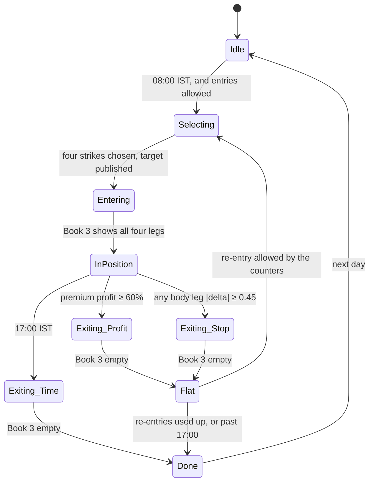

# The strategy worker

**What this page contains.** What a strategy program is allowed to know and to say, how one is started,
what it keeps across a restart, and the sample strategy (a daily iron condor) drawn as a state machine
so that every rule in its description has one place to live.

**How to read it.** The first three sections are the contract every strategy obeys. The sample strategy
after them is a worked example of that contract, and the place to check that the contract is enough.

## What a strategy is

A **strategy** is one running program that holds an opinion about what position to have, and publishes
that opinion as a whole every time it changes. The opinion is Book 1 in [books.md](books.md): signed
lots per contract. That is the entire output.

**Logic only.** A strategy never says *how* to get from what is held to what it wants. It never names
an order, a limit price, a market order, a leg sequence, or a retry. When a strategy wants out of a
leg, it publishes a target without that leg. The OMS does the rest. This is the one rule the senior set
for this part, and the contract is shaped so that breaking it is not possible by accident: there is no
event a strategy can publish that carries an order.

## What a strategy reads and asks

| Input | Where it comes from | Why |
|---|---|---|
| The option chain with our Greeks | the `computed.chain` events for its underlying | Strike selection by delta uses **our** delta. The venue's Greeks are reference columns and never inputs, a rule the whole repository already keeps. |
| Its own actual position | Book 3 for its strategy identifier, published by the OMS | So it knows whether it is in, and with what, without ever talking to a broker. Book 3 can move without a fill of its own: orders are pooled, so lots the engine already held may be reallocated between strategies ([books.md](books.md)). A strategy reads its book and never assumes it changes only when it acted. |
| The time | a small `Clock` object it asks | Live, the clock is the wall clock. The same object can later be fed the timestamps of replayed events, so a strategy could run against the Parquet store without a change. That replay is not built; the object costs one interface now. |
| Its parameters | environment variables set in the compose file | Lots, times, delta targets, limits. Read once at start. |

A strategy evaluates its rules every time a new chain arrives for its expiry (about once a second) and
once a second on the clock, so a time rule fires even when the market is silent.

## How a strategy becomes a process

**One compose service per running strategy, all from one image.** The service's environment says
which strategy logic to run, what to call this instance, which venue's books it targets, and its
parameters. Adding a strategy is adding a service; nothing running is touched. Compose and ECS restart,
log and health-check each one on its own. This is the change-safety the senior gave as the reason for
a message bus at all.

| Setting | Example | Meaning |
|---|---|---|
| `STRATEGY` | `iron_condor_0dte` | Which strategy code to run |
| `STRATEGY_ID` | `icbtc1` | This instance's name. Short, because it travels inside every client order id, which Delta caps at 32 characters |
| `VENUE` | `PAPER` or `DELTA` | Whose books this strategy's target goes to. The sandbox OMS reads `PAPER`; the live OMS reads `DELTA` |
| `UNDERLYING` | `BTC` | One underlying per instance |
| `PARAMS` | JSON | The strategy's own parameters, below |

## What survives a restart

In-memory state dies with a process. The senior named this as the gap in his own system. Here a
strategy writes **one row in Postgres** every time its state changes — the `strategy_state` table, one
row per strategy — and reads it once at start. The *event* it publishes on the same move is
`strategy.transition`, named differently on purpose so that the row and the event are never confused:

| Field | What it holds |
|---|---|
| `state` | Which box of the state machine below it is in |
| `entries_today`, `reentries_after_stop`, `reentries_after_profit` | The counters the re-entry rules read |
| `entry_credit` | The net premium received when the current position was opened |
| `intended_legs` | The four contracts it chose, so a restart can tell a fill from a stranger |
| `day` | The trading day the counters belong to; a new day resets them |

Its *position* is never stored by the strategy. Book 3 is the truth for that, and a restarted strategy
reads Book 3 first and its row second. If Book 3 holds legs the row does not know, the strategy alerts
and does nothing until a person looks. That is the one behaviour on this page chosen for safety over
convenience.

## The sample strategy: a daily 0dte iron condor

The description, as given:

> Every day at 08:00 IST, sell a 0dte iron condor: each body leg targets |delta| = 0.25, wings two
> strikes further out. Take profit when premium profit reaches 60%. Stop-loss a body leg when its
> |delta| reaches 0.45. Exit everything at 17:00 IST. Re-enter at most twice after a stop (three
> entries in all). Re-enter at most once after a profit take.

One venue fact frames it: Delta's daily options settle at 12:00 UTC, which is 17:30 IST, and the venue
closes every open position at settlement. The 17:00 IST exit is thirty minutes before that.

| Rule in the description | Where it lives | Made precise as |
|---|---|---|
| 08:00 IST entry | `Idle → Selecting` | The clock, in IST. Engine time is UTC; the parameter is converted once |
| Body legs at \|delta\| 0.25 | `Selecting` | The strike whose **our** delta is nearest 0.25 on each side, from today's expiry |
| Wings two strikes out | `Selecting` | Two rows further along the chain's strike ladder, on each side |
| Take profit at 60% | `InPosition → Exiting_Profit` | (credit at entry − cost to close all four at mid) ÷ credit at entry ≥ 0.60 |
| Stop-loss at \|delta\| 0.45 | `InPosition → Exiting_Stop` | Publishes a target without **that side**, body and wing together. The other side stays. A wing left alone is a lottery ticket; the other side keeps its credit |
| Exit at 17:00 IST | `InPosition → Exiting_Time` | Empty target |
| Two re-entries after a stop | `Flat → Selecting` | Counts stop events; a re-entry rebuilds the stopped side at fresh 0.25-delta strikes |
| One re-entry after a profit | `Flat → Selecting` | A fresh full condor |
| Lots | parameter `lots` | Sizing is logic and belongs here. Execution is not and does not |

**What "entering" means without orders.** The strategy publishes the target and moves to `Entering`.
It learns it is in when Book 3 shows the legs. If the OMS could not get there (a risk reject, a
timeout), Book 3 never shows them; the strategy stays in `Entering` and the OMS's own events say why.
The strategy does not retry, because retrying is an execution decision.

## Open questions

- After a one-sided stop, whether a re-entry rebuilds that side only (as written) or closes the whole
  condor and re-enters fresh. The counters are the same either way. Ask the senior.
- Whether "premium profit" should be marked at mid, or at the price the position could actually be
  closed at (the ask for buys, the bid for sells). Mid is written; the second is more honest and more
  volatile on thin wings.
- What a strategy should do when the chain has no strike near 0.25 delta, which happens late in a 0dte
  day. Written: no entry, and an event saying so.

## Where to go next

[oms.md](oms.md) is what happens to the target after it is published.
