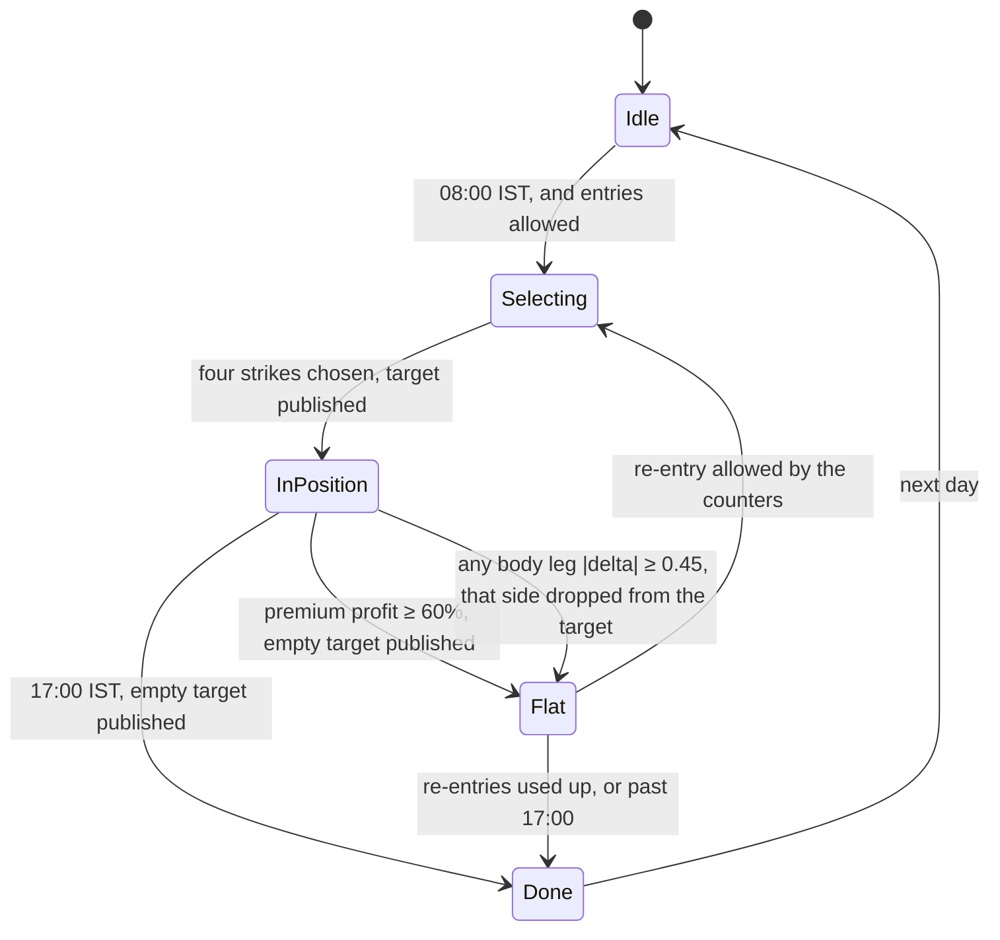

# The strategy worker

**What this page contains.** What a strategy program is allowed to know and to say, how one is started,
the model position it follows, what it keeps across a restart and how it gets it back, the signal card
it records at every decision,
and the sample strategy (a daily iron condor) drawn as a state machine so that every rule in its
description has one place to live.

**How to read it.** The first six sections are the contract every strategy obeys. The sample strategy
after them is a worked example of that contract, and the place to check that the contract is enough.

## What a strategy is

A **strategy** is one running program that holds an opinion about what position to have, and publishes
that opinion as a whole every time it changes. The opinion is a **target**: signed **units** per
contract, where one unit is the strategy's own leg ratio. That is the entire output. One strategy
serves every client subscribed to it; each client's OMS multiplies the target by that client's units
to make the client's Book 1 ([clients.md](clients.md)). A strategy never names a client.

**Logic only.** A strategy never says *how* to get from what is held to what it wants. It never names
an order, a limit price, a market order, a leg sequence, or a retry. When a strategy wants out of a
leg, it publishes a target without that leg. The OMS does the rest. The contract is shaped so that breaking this rule is not
possible by accident: there is no event a strategy can publish that carries an order.

## What a strategy reads and asks

| Input | Where it comes from | Why |
|---|---|---|
| The option chain with our Greeks | the `computed.chain` events for its underlying | Strike selection by delta uses **our** delta. The venue's Greeks are reference columns and never inputs, a rule the whole repository already keeps. |
| Its own position | its **model position**: its last published target, and its checkpoint | Below. A strategy reads no client's books and no fills |
| The time | a small `Clock` object it asks | Live, the clock is the wall clock. The same object can later be fed the timestamps of replayed events, so a strategy could run against the Parquet store without a change. That replay is not built; the object costs one interface now. |
| Its parameters | environment variables set in the compose file | Times, delta targets, thresholds. Read once at start. Size is not a parameter: it belongs to each client. |

A strategy evaluates its rules every time a new chain arrives for its expiry (about once a second) and
once a second on the clock, so a time rule fires even when the market is silent.

## How a strategy becomes a process

**One compose service per running strategy, all from one image.** The service's environment says
which strategy logic to run, what to call this instance, which market it trades, and its
parameters. Adding a strategy is adding a service; nothing running is touched. Compose and ECS restart,
log and health-check each one on its own, so a new strategy cannot disturb a running one.

| Setting | Example | Meaning |
|---|---|---|
| `STRATEGY` | `iron_condor_0dte` | Which strategy code to run |
| `STRATEGY_ID` | `icbtc1` | This instance's name. Short, because it travels inside every client order id, which Delta caps at 32 characters |
| `MARKET` | `DELTA`, `NSE`, `CBOE` | The exchange whose contracts it trades. Its target goes to `strategy.target:{MARKET}`, read by every client OMS on that market, paper or real |
| `UNDERLYING` | `BTC` | One underlying per instance |
| `PARAMS` | JSON | The strategy's own parameters, below |

## The model position

Many clients follow one strategy, and each gets its own fills at its own prices; some may miss a leg.
A strategy cannot follow all of them, so it follows none. Its **model position** is the target it last
published, **assumed held from the moment it is published**, and priced from its own signal card at
the touch: the ask for a leg it buys, the bid for a leg it sells. Its entry credit, its take-profit and
its state machine all run on that model. Each client's OMS then works to make the client's real
position match it ([oms.md](oms.md)), and handles a failure alone.

> **To review: the model position and a client's real position can differ.** The strategy believes it
> holds the full target. A client whose OMS failed some legs may hold something else — only the wings
> of a condor, which is a long strangle. The strategy's exits still reach that client, because an empty
> target closes whatever the client holds, but its entries, stops and take-profit are decided on a
> position the client may not have. To review before the first real client trades.

## What survives a restart

In-memory state dies with a process, so a strategy saves a **checkpoint** every time its state
changes. It has no database connection: it publishes the checkpoint as a `strategy.checkpoint` event,
and the persistence service writes it to Postgres ([message-bus.md](message-bus.md)).

**One table for every strategy, one row per checkpoint, none ever overwritten.** The table is
`strategy_checkpoints`:

| Column | What it holds |
|---|---|
| `strategy_id` | Which strategy, so the table is strategy-wise without a table per strategy |
| `seq` | The checkpoint's number, rising by one each time |
| `taken_at` | When it was taken |
| `decision_id` | The decision that moved the state, so a checkpoint can be found from a trace |
| `state` | The strategy's own state, as JSONB |

The `state` of the sample strategy holds:

| Field | What it holds |
|---|---|
| `schema_version` | The shape of this JSONB, so newer strategy code can recognise an older checkpoint and convert it or refuse it |
| `state` | Which box of the state machine below it is in |
| `entries_today`, `reentries_after_stop`, `reentries_after_profit` | The counters the re-entry rules read |
| `entry_credit` | The net premium of the current position at entry, priced at the touch from the signal card |
| `intended_legs` | The four contracts it chose: the model position |
| `day` | The trading day the counters belong to; a new day resets them |

A strategy changes state a few dozen times a day, so keeping every checkpoint costs little, and a
person tracing a decision can read the state at any moment.

**Getting it back.** On start, a strategy publishes `strategy.restore_request` with its id. The
persistence service reads the row with the highest `seq` for that strategy and publishes it back as
`strategy.restore`. Until that reply arrives the strategy **does not evaluate**: it raises an alert and
asks again every 10 seconds. A strategy with no checkpoint at all (its first run) receives an empty
reply and starts in `Idle`.

The checkpoint holds the model position, so a restarted strategy needs nothing else: it loads the
checkpoint and republishes its target. It reads no client's books on the way.

## The signal card

At every decision a strategy records what it saw, so that later the price it acted on can be compared
with the price it got. This record is the **signal card**. It is published as a
`strategy.signal_card` event with the same `decision_id` as the target it explains, and the persistence
service writes it to the `signal_cards` table, **one row per leg**:

| Field | What it holds |
|---|---|
| `decision_id`, `strategy_id`, `decided_at` | Which decision, by whom, when |
| `contract` | The leg |
| `bid`, `ask`, `mid` | The quote at decision time |
| `delta`, `gamma`, `vega`, `theta`, `iv` | **Our** Greeks and implied volatility for that contract |
| `underlying_price` | The underlying's price at decision time |
| `chain_snapshot` | Which chain snapshot it looked at, so the whole chain can be opened from S3 |

**Slippage is one join**: `fills` to `signal_cards` on `decision_id` and contract. The signal card is
research data and **nothing on the order path reads it**. The whole chain stays in the Parquet files on
S3; the card only names the snapshot.

## The sample strategy: a daily 0dte iron condor

The description:

> Every day at 08:00 IST, sell a 0dte iron condor: each body leg targets |delta| = 0.25, wings two
> strikes further out. Take profit when premium profit reaches 60%. Stop-loss a body leg when its
> |delta| reaches 0.45. Exit everything at 17:00 IST. Re-enter at most twice after a stop (three
> entries in all). Re-enter at most once after a profit take.

One venue fact frames it: Delta's daily options settle at 12:00 UTC, which is 17:30 IST, and the venue
closes every open position at settlement. The 17:00 IST exit is thirty minutes before that.

```mermaid
stateDiagram-v2
  [*] --> Idle
  Idle --> Selecting : 08:00 IST, and entries allowed
  Selecting --> InPosition : four strikes chosen, target published
  InPosition --> Flat : premium profit ≥ 60%, empty target published
  InPosition --> Flat : any body leg |delta| ≥ 0.45, that side dropped from the target
  InPosition --> Done : 17:00 IST, empty target published
  Flat --> Selecting : re-entry allowed by the counters
  Flat --> Done : re-entries used up, or past 17:00
  Done --> Idle : next day
```

| Rule in the description | Where it lives | Made precise as |
|---|---|---|
| 08:00 IST entry | `Idle → Selecting` | The clock, in IST. Engine time is UTC; the parameter is converted once |
| Body legs at \|delta\| 0.25 | `Selecting` | The strike whose **our** delta is nearest 0.25 on each side, from today's expiry |
| Wings two strikes out | `Selecting` | Two rows further along the chain's strike ladder, on each side |
| Take profit at 60% | `InPosition → Flat` | (credit at entry − cost to close all four at mid) ÷ credit at entry ≥ 0.60 |
| Stop-loss at \|delta\| 0.45 | `InPosition → Flat` | Publishes a target without **that side**, body and wing together. The other side stays. A wing left alone is a lottery ticket; the other side keeps its credit |
| Exit at 17:00 IST | `InPosition → Done` | Empty target |
| Two re-entries after a stop | `Flat → Selecting` | Counts stop events; a re-entry rebuilds the stopped side at fresh 0.25-delta strikes |
| One re-entry after a profit | `Flat → Selecting` | A fresh full condor |
| Size | each client's units | One unit is +1, −1, −1, +1 across the four strikes. How many units a client holds is the client's choice ([clients.md](clients.md)) |

**What "in position" means without orders.** The strategy publishes the target and is in position at
once, on its model. Whether each client got there is that client's OMS's business: a risk reject, a
timeout or a missed leg shows in the client's own events and alerts. The strategy does not retry,
because retrying is an execution decision.

## Open questions

- After a one-sided stop, whether a re-entry rebuilds that side only (as written) or closes the whole
  condor and re-enters fresh. The counters are the same either way. Ask Bilal.
- Whether "premium profit" should be marked at mid, or at the price the position could actually be
  closed at (the ask for buys, the bid for sells). Mid is written; the second is more honest and more
  volatile on thin wings.
- What a strategy should do when the chain has no strike near 0.25 delta, which happens late in a 0dte
  day. Written: no entry, and an event saying so.

## Where to go next

[oms.md](oms.md) is what happens to the target after it is published.
